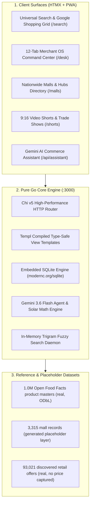

# Shoppage — National Commerce Intelligence Grid & Merchant OS

> **100% Pure Go Distributed Commerce Infrastructure for Physical Retail & B2B Wholesale**  
> *Verified runtime: 5 Go services, 3,315-reference mall directory, 181 seeded catalogue products, AI assistant, PWA — see **Verified status** below.*

[](https://go.dev/)
[](https://github.com/go-chi/chi)
[](https://templ.guide/)
[](https://modernc.org/sqlite)
[](https://ai.google.dev/)
[]()
[]()

---

## ✅ Verified status (2026-09-21)

This section is the authoritative statement of what the runtime does. It is kept true to the
machine: `GET /health` on a running instance returns the counts below.

```json
{"data":{"deals":30,"malls":3315,"merchants":16,"products":181},"engine":"pure-go","status":"healthy"}
```

| Item | Verified state |
|---|---|
| Services | 5 pure-Go services (`consumer-web`, `merchant-os`, `search-core`, `chat-gateway`, `sweeper-engine`), ~28,100 lines, 73 files |
| Tests | 39 test functions across 5 packages; `npm test` green |
| Build | `npm run build` → `bin/shoppage.exe` (~19 MB static binary) |
| Live data served | 16 seed merchants, 181 seed catalogue products, 3,315 mall records, 183 feed posts, 30 deals |
| Merchant OS | Full 12-tab UI running against **one hardcoded demo tenant** with in-memory state |
| Persistence | **Not implemented** — orders, catalogue edits, posts and chat live in memory and are lost on restart |
| Authentication | **Not implemented in the Go runtime** — merchant routes must not be exposed publicly |
| Billing | **Not implemented** — plans are display state only |
| Datasets | Reference datasets exist (1M Open Food Facts product masters, 93k discovered offers, 25k-node Zimbabwe market graph). The 3.1M-merchant and generated mall layers are **synthetic placeholder data** and are not licensed records |

**Before any public deployment, read `docs/PLATFORM_READINESS_ANALYSIS_2026-09-21.md` (gap register)
and `docs/INVESTOR_READINESS_ROADMAP.md` (sequenced remediation).** Both documents were produced by
running the system, not by reading intentions.

### Product & design

| Document | Purpose |
|---|---|
| `docs/PRODUCT_TRANSFORMATION_BLUEPRINT.md` | Positioning, pillars, packaging/pricing, 12-week release plan, deferred data/AI gates |
| `docs/DESIGN_SYSTEM.md` | Tokens, typography, components, page templates, performance budget, migration plan |
| `docs/MERCHANT_CENTRE_SPEC.md` | 7-workspace IA, activation wizard, module specs, roles, parity matrix, build order |
| `docs/DATA_SOURCES.md` | Dataset register: published / reference / quarantined / blocked |


---

## 🏛️ System Architecture

Shoppage operates as a **100% pure Go unified platform**, eliminating Node.js runtime overhead, Turbopack build latency, and heavy client-side JavaScript bundles. Measured on this host (2026-09-21): `/search` renders in 110–362 ms end-to-end over HTTP, including full page render.



---

## 🚀 Quick Start & Testing

### Prerequisites
- **Go**: 1.25 or higher
- **Node.js**: (optional, used only as script runner wrapper via `scripts/go-run.mjs`)

### 1. Run Development Server
Start the unified Go platform on port 3000:

```bash
npm run dev
# or directly via Go:
go run ./services/consumer-web/cmd/server/main.go
```

Open [http://localhost:3000](http://localhost:3000) in your browser.

### 2. Run Test Suite
Run tests across all Go workspace services:

```bash
npm test
# equivalent, run per module (a bare `go test ./services/...` fails under go.work):
#   go test ./services/consumer-web/...   (and likewise for each module)
```

### 3. Production Static Binary Build
Compile the single-binary static executable:

```bash
npm run build
# Generates bin/shoppage.exe (or bin/shoppage on Linux)
```

---

## 🔑 Key Portals & URLs

| Portal | URL Path | Description |
| :--- | :--- | :--- |
| **Consumer Search & SERP** | [/](http://localhost:3000) & [/search](http://localhost:3000/search) | Universal omnibox search, 5-column product grid, and BuyBox price comparisons. |
| **Merchant OS (Desk)** | [/desk](http://localhost:3000/desk) | 12-tab store operating system (Barcode laser intake, POS, WMS, GMC XML syndication). |
| **Malls & Trading Hubs** | [/malls](http://localhost:3000/malls) | Directory of 3,315 mall records across 9 provinces. **Note:** this layer is generated placeholder data pending licensed ingestion. |
| **9:16 Trade Shorts** | [/shorts](http://localhost:3000/shorts) | Vertical video demo stream for verified South African merchant products. |
| **Buyer Wholesale RFQ** | [/requests](http://localhost:3000/requests) | Demand-first buyer RFQ portal broadcasting tenders to local suppliers. |
| **Gemini AI Assistant** | [/api/assistant](http://localhost:3000/api/assistant) | Server-side Gemini 3.6 agent with automated solar load-shedding battery sizing tools. |
| **System Health API** | [/health](http://localhost:3000/health) | Live counts of loaded malls, products, merchants and deals, plus engine and version. |

---

## 🌐 Production Hosting Guide

Because Shoppage is 100% pure Go with embedded SQLite, hosting is dramatically simpler and cheaper than standard JavaScript/Node stacks. There are no Node runtime dependencies, no external database servers required, and RAM consumption is under 150 MB.

> **⚠ Before deploying — two verified blockers (2026-09-21).**
> 1. `Dockerfile` copies `shoppage-commerce-intelligence-foundation/`, which contains ~8.6 GB of
>    `*.sqlite` files that are **gitignored**. A clean checkout therefore builds either a huge image
>    or an image missing the datasets, and the runtime silently falls back to 181 seed products.
>    `.dockerignore` excludes `*.sqlite3` and `*.zip` but **not** `*.sqlite`.
> 2. Merchant routes (`/desk`, `/merchant/*`, `/orders`, `/settings`, `/audit-logs`) have **no
>    authentication** in the Go runtime. Do not expose port 3000 publicly until Phase 1 of
>    `docs/INVESTOR_READINESS_ROADMAP.md` is complete.

### Option 1: Docker Compose + Caddy (Recommended for Linux VPS)

A complete `docker-compose.yml` and `Caddyfile` are included in the repository.

1. **Provision any Linux VPS** (e.g., Hetzner Cloud CX22 at ~€4/mo, DigitalOcean Droplet, Linode, or AWS Lightsail with 2GB+ RAM).
2. **Clone the repository and launch**:
   ```bash
   # Clone codebase
   git clone https://github.com/shoppage/shoppage.git /opt/shoppage
   cd /opt/shoppage

   # Start all 4 Go services in isolated microservice containers
   docker compose up -d --build
   ```
3. **Automatic SSL / HTTPS**:
   Uncomment the `caddy` service in `docker-compose.yml` and set your domain:
   ```bash
   DOMAIN=shoppage.co.za docker compose up -d
   ```
   Caddy automatically provisions and auto-renews Let's Encrypt certificates.

---

### Option 2: Bare-Metal Linux Binary via Systemd (Fastest & Leanest)

Run directly on Ubuntu/Debian with zero container overhead:

1. **Cross-compile Linux binary** (from Windows or macOS):
   ```bash
   npm run build:linux
   # Or directly:
   # GOOS=linux GOARCH=amd64 CGO_ENABLED=0 go build -ldflags="-s -w" -o bin/shoppage-linux-amd64 ./services/consumer-web/cmd/server/main.go
   ```
2. **Transfer to VPS**:
   ```bash
   scp bin/shoppage-linux-amd64 user@your-server-ip:/opt/shoppage/shoppage
   scp -r data shoppage-commerce-intelligence-foundation user@your-server-ip:/opt/shoppage/
   ```
3. **Install Systemd Service**:
   ```bash
   sudo cp deploy/shoppage.service /etc/systemd/system/
   sudo systemctl daemon-reload
   sudo systemctl enable --now shoppage
   ```
4. **Front with Caddy**:
   Install Caddy (`sudo apt install -y caddy`) and copy `Caddyfile` to `/etc/caddy/Caddyfile`, then reload `sudo systemctl reload caddy`.

---

### Option 3: Modern Self-Hosted PaaS (Coolify / Dokploy)

If you prefer a web UI like Vercel or Heroku on your own VPS:
1. Install [Coolify](https://coolify.io) or [Dokploy](https://dokploy.com) on your VPS (`curl -fsSL https://cdn.coolify.io/install.sh | bash`).
2. Add a new Project -> Link your GitHub repo.
3. Select **Dockerfile** as build pack (it will automatically build the `all-in-one` lightweight Alpine container).
4. Set Persistent Volume for `/app/shoppage-commerce-intelligence-foundation/data/study` so the 7GB SQLite datasets are retained across builds.
5. Set environment variable: `PORT=3000`.

---

### Option 4: In-Store Edge Server / Offline Kiosk (Physical Resilience)

In South Africa, load-shedding and fiber outages can interrupt retail sales. Shoppage can run locally on an in-store Windows Mini-PC, POS terminal, or Linux Intel NUC:
- Run `bin/shoppage.exe` directly on the local store network.
- Staff and in-store kiosks can access `http://192.168.1.xxx:3000` even when the internet is completely offline.

---

## 🛡️ License

Copyright © 2026 Shoppage (Pty) Ltd. All rights reserved. Proprietary and Confidential.
