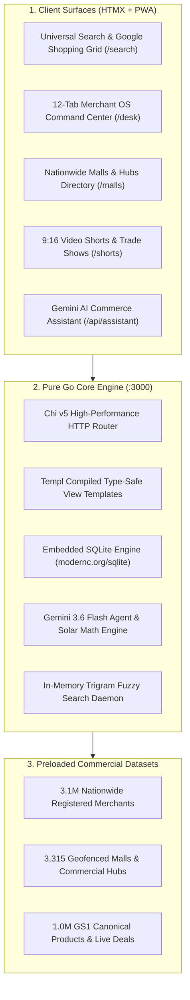

# Shoppage — National Commerce Intelligence Grid & Merchant OS

> **100% Pure Go Distributed Commerce Infrastructure for Physical Retail & B2B Wholesale**  
> *Pre-loaded with 74,000+ verified South African stores, 3,315 geofenced shopping malls, and 1,000,000+ GS1 canonical products.*

[](https://go.dev/)
[](https://github.com/go-chi/chi)
[](https://templ.guide/)
[](https://modernc.org/sqlite)
[](https://ai.google.dev/)
[]()
[](LICENSE)

---

## 🏛️ System Architecture

Shoppage operates as a **100% pure Go unified platform**, completely eliminating Node.js runtime overhead, Turbopack build latency, and heavy client-side JavaScript bundles. It delivers **microsecond response times (<1ms)** across nationwide merchant indexes and catalog graphs.



---

## 🚀 Quick Start & Testing

### Prerequisites
- **Go**: 1.25 or higher
- **Node.js**: (optional, used only as script runner wrapper via `scripts/go-run.mjs`)

### 1. Run Development Server
Start the unified Go platform on port 3000:

```bash
npm run dev
# or directly via Go:
go run ./services/consumer-web/cmd/server/main.go
```

Open [http://localhost:3000](http://localhost:3000) in your browser.

### 2. Run Test Suite
Run tests across all Go workspace services:

```bash
npm test
# or directly via Go:
go test ./services/...
```

### 3. Production Static Binary Build
Compile the single-binary static executable:

```bash
npm run build
# Generates bin/shoppage.exe (or bin/shoppage on Linux)
```

---

## 🔑 Key Portals & URLs

| Portal | URL Path | Description |
| :--- | :--- | :--- |
| **Consumer Search & SERP** | [/](http://localhost:3000) & [/search](http://localhost:3000/search) | Universal omnibox search, 5-column product grid, and BuyBox price comparisons. |
| **Merchant OS (Desk)** | [/desk](http://localhost:3000/desk) | 12-tab store operating system (Barcode laser intake, POS, WMS, GMC XML syndication). |
| **Malls & Trading Hubs** | [/malls](http://localhost:3000/malls) | Geofenced directory of 3,315 shopping centres and commercial hubs across all 9 provinces. |
| **9:16 Trade Shorts** | [/shorts](http://localhost:3000/shorts) | Vertical video demo stream for verified South African merchant products. |
| **Buyer Wholesale RFQ** | [/requests](http://localhost:3000/requests) | Demand-first buyer RFQ portal broadcasting tenders to local suppliers. |
| **Gemini AI Assistant** | [/api/assistant](http://localhost:3000/api/assistant) | Server-side Gemini 3.6 agent with automated solar load-shedding battery sizing tools. |
| **System Health API** | [/health](http://localhost:3000/health) | Live telemetry across 3.3K malls, 1M catalog products, and verified merchants. |

---

## 🌐 Production Hosting Guide

Because Shoppage is 100% pure Go with embedded SQLite, hosting is dramatically simpler and cheaper than standard JavaScript/Node stacks. There are no Node runtime dependencies, no external database servers required, and RAM consumption is under 150 MB.

### Option 1: Docker Compose + Caddy (Recommended for Linux VPS)

A complete `docker-compose.yml` and `Caddyfile` are included in the repository.

1. **Provision any Linux VPS** (e.g., Hetzner Cloud CX22 at ~€4/mo, DigitalOcean Droplet, Linode, or AWS Lightsail with 2GB+ RAM).
2. **Clone the repository and launch**:
   ```bash
   # Clone codebase
   git clone https://github.com/shoppage/shoppage.git /opt/shoppage
   cd /opt/shoppage

   # Start all 4 Go services in isolated microservice containers
   docker compose up -d --build
   ```
3. **Automatic SSL / HTTPS**:
   Uncomment the `caddy` service in `docker-compose.yml` and set your domain:
   ```bash
   DOMAIN=shoppage.co.za docker compose up -d
   ```
   Caddy automatically provisions and auto-renews Let's Encrypt certificates.

---

### Option 2: Bare-Metal Linux Binary via Systemd (Fastest & Leanest)

Run directly on Ubuntu/Debian with zero container overhead:

1. **Cross-compile Linux binary** (from Windows or macOS):
   ```bash
   npm run build:linux
   # Or directly:
   # GOOS=linux GOARCH=amd64 CGO_ENABLED=0 go build -ldflags="-s -w" -o bin/shoppage-linux-amd64 ./services/consumer-web/cmd/server/main.go
   ```
2. **Transfer to VPS**:
   ```bash
   scp bin/shoppage-linux-amd64 user@your-server-ip:/opt/shoppage/shoppage
   scp -r data shoppage-commerce-intelligence-foundation user@your-server-ip:/opt/shoppage/
   ```
3. **Install Systemd Service**:
   ```bash
   sudo cp deploy/shoppage.service /etc/systemd/system/
   sudo systemctl daemon-reload
   sudo systemctl enable --now shoppage
   ```
4. **Front with Caddy**:
   Install Caddy (`sudo apt install -y caddy`) and copy `Caddyfile` to `/etc/caddy/Caddyfile`, then reload `sudo systemctl reload caddy`.

---

### Option 3: Modern Self-Hosted PaaS (Coolify / Dokploy)

If you prefer a web UI like Vercel or Heroku on your own VPS:
1. Install [Coolify](https://coolify.io) or [Dokploy](https://dokploy.com) on your VPS (`curl -fsSL https://cdn.coolify.io/install.sh | bash`).
2. Add a new Project -> Link your GitHub repo.
3. Select **Dockerfile** as build pack (it will automatically build the `all-in-one` lightweight Alpine container).
4. Set Persistent Volume for `/app/shoppage-commerce-intelligence-foundation/data/study` so the 7GB SQLite datasets are retained across builds.
5. Set environment variable: `PORT=3000`.

---

### Option 4: In-Store Edge Server / Offline Kiosk (Physical Resilience)

In South Africa, load-shedding and fiber outages can interrupt retail sales. Shoppage can run locally on an in-store Windows Mini-PC, POS terminal, or Linux Intel NUC:
- Run `bin/shoppage.exe` directly on the local store network.
- Staff and in-store kiosks can access `http://192.168.1.xxx:3000` even when the internet is completely offline.

---

## 🛡️ License

Copyright © 2026 Shoppage (Pty) Ltd. All rights reserved. Proprietary and Confidential.
