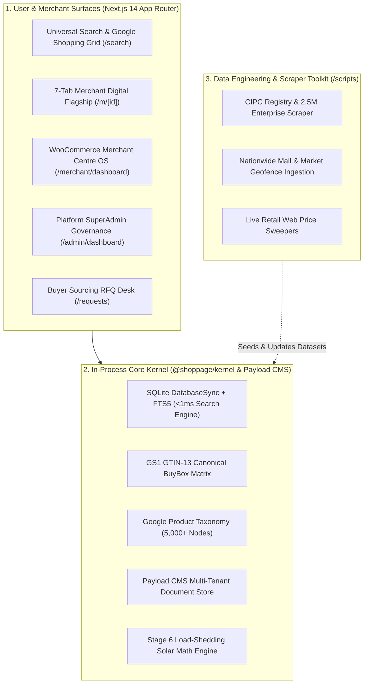

# Shoppage — National Commerce Intelligence Grid & Merchant OS

> **0% Take-Rate Distributed Commerce Infrastructure for Physical Retail & B2B Wholesale**  
> *Pre-loaded with 74,000+ verified South African stores, 3,296 geofenced shopping malls, and 1,000,000+ GS1 canonical products.*

[](https://nextjs.org/)
[](https://payloadcms.com/)
[](https://www.sqlite.org/fts5.html)
[](https://www.typescriptlang.org/)
[](LICENSE)

---

## 🏛️ System Architecture

Shoppage operates as a **single, unified TypeScript / Node.js runtime**, eliminating microservice serialization lag and delivering **sub-1ms search latency** across millions of records.



---

## 🚀 Quick Start Guide

### Prerequisites
- **Node.js**: `v20.x` or higher
- **npm**: `v10.x` or higher
- **Python**: `3.10+` *(Optional: only needed for running offline data ingestion scripts in `/scripts`)*

### 1. Installation
Clone the repository and install all workspace dependencies:

```bash
git clone https://github.com/pmvalues/shoppagepy.git
cd shoppagepy
npm install
```

### 2. Run Development Server
Start the unified Next.js 14 web application:

```bash
npm run dev
```

Open [http://localhost:3000](http://localhost:3000) in your browser.

### 3. Production Build
Compile all TypeScript monorepo packages and generate the optimized production build:

```bash
npm run build
npm run start
```

---

## 🔑 Key Portals & URLs

| Portal | URL Path | Description |
| :--- | :--- | :--- |
| **Consumer Search & SERP** | [`/`](http://localhost:3000) & [`/search`](http://localhost:3000/search) | Universal omnibox search, Google Shopping 5-column grid, AI Knowledge Graph, and BuyBox price comparisons. |
| **Mitrend Flagship Showroom** | [`/m/loc_mitrend_midrand`](http://localhost:3000/m/loc_mitrend_midrand) | 157 live catering & packaging products, interactive live broadcast studio, 9:16 video shorts, and WhatsApp Quick Cart. |
| **Merchant Centre OS** | [`/merchant/dashboard`](http://localhost:3000/merchant/dashboard) | Full WooCommerce-grade store dashboard (product management, inventory, orders, customer CRM, and Google Shopping XML feeds). |
| **Platform SuperAdmin** | [`/admin/dashboard`](http://localhost:3000/admin/dashboard) | National telemetry across 74K stores, 1M+ catalog inspector, CIPC compliance audit queue, and store masquerade. |
| **Enterprise Login Gateway** | [`/admin`](http://localhost:3000/admin) | Enterprise single sign-on portal with role toggles and SSL/CIPC compliance badges. |
| **Buyer Wholesale RFQ** | [`/requests`](http://localhost:3000/requests) | Demand-first buyer RFQ portal broadcasting tenders to local verified suppliers. |
| **Malls & Trading Hubs** | [`/malls`](http://localhost:3000/malls) | Geofenced directory of 3,296 shopping centres and commercial hubs across all 9 provinces. |

---

## 💼 Commercial Model (0% Take-Rate)

Shoppage counter-positions against legacy marketplace toll-booths (Takealot, Amazon SA) by charging **0% commission** on merchant transactions. Monetization is achieved via high-margin B2B software and advertising streams:

1. **Merchant OS SaaS Subscriptions** (R499 – R2,499/month): Automated Google Merchant Center XML syndication, advanced CRM, multi-branch inventory.
2. **Local Showroom Geo-Ads**: 25km radius keyword bidding for local physical store walk-ins.
3. **CIPC Verified Trust Seals**: Enterprise compliance verification and priority SERP BuyBox placement.
4. **Wholesale RFQ Lead Matching**: Commercial procurement fees for verified contractor matchmaking.

---

## 📂 Project Structure

```
.
├── apps/
│   └── web/                   # Next.js 14 App Router Web Application
│       ├── src/app/           # 28 Production Pages and Route Handlers
│       ├── src/cms/           # Payload CMS 3.0 Collections & Typed Service
│       ├── src/components/    # Reusable UI Components (Omnibox, SERP, Studio)
│       └── src/lib/           # AI Intelligence Layer & Live Scraper Sweepers
├── packages/
│   ├── contracts/             # Shared TypeScript Domain Types & Interfaces
│   ├── kernel/                # Core In-Memory SQLite FTS5 Engine & Datasets
│   ├── adapters/              # External Ingestion & Feed Adapters
│   └── eval/                  # Search Quality & Latency Benchmark Suite
├── scripts/                   # Standalone Python Data Ingestion & Sweeper Toolkit
│   ├── ingestion/             # 2.5M Enterprise & Mall Registry Ingestion
│   ├── scrapers/              # Retail Web Price Sweepers & Maps Scrapers
│   └── analytics/             # FTS5 Index Optimization & Quality Audits
└── Dockerfile                 # Single-Stage Next.js Production Container
```

---

## 🛡️ License

Copyright © 2026 Shoppage (Pty) Ltd. All rights reserved. Proprietary and Confidential.
