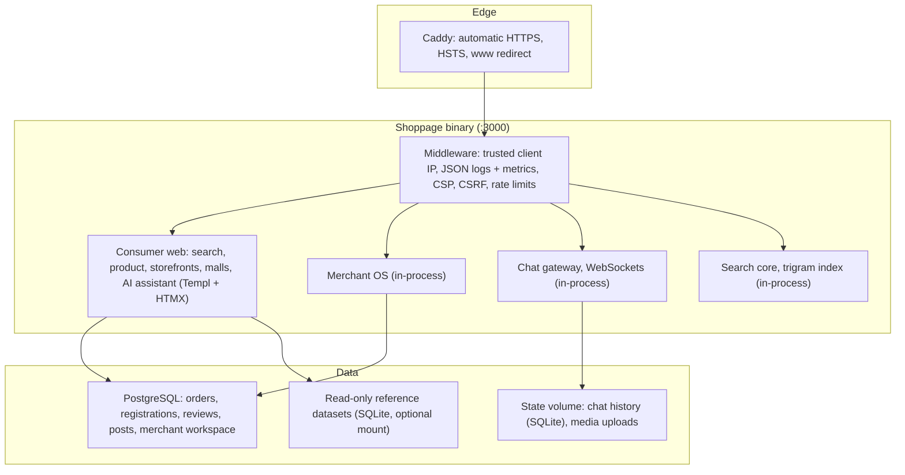

# Shoppage — National Commerce Intelligence Grid & Merchant OS

> **Go commerce platform for physical retail and B2B wholesale in South Africa**  
> *One Go binary serving the consumer site, Merchant OS, live chat, search and an AI assistant, backed by PostgreSQL. See **Verified status** below.*

[](https://go.dev/)
[](https://github.com/go-chi/chi)
[](https://templ.guide/)
[](https://www.postgresql.org/)
[](https://ai.google.dev/)
[]()
[]()

---

## ✅ Verified status (2026-09-25)

This section is the authoritative statement of what the runtime does. `GET /healthz` on a running
instance returns the live catalogue counts.

| Item | Verified state |
|---|---|
| Runtime | **One Go binary** (`services/consumer-web/cmd/server`) that mounts Merchant OS, the chat gateway and the search core in-process; each can still be split out (`docs/DEPLOYMENT.md`). `sweeper-engine` is a separate batch CLI |
| Tests | 76 test functions across 15 packages, race detector on, including PostgreSQL integration tests (`make test-db`) |
| Live data served | 16 seed merchants, 181 seed catalogue products, 3,315 mall records, 183 feed posts, 30 deals |
| Persistence | **PostgreSQL** (pgx, migrations embedded with goose). Orders, supplier registrations, reviews, feed posts and the Merchant OS workspace survive restarts. Chat history is SQLite on the state volume |
| Merchant OS | Full workspace UI for **one tenant** (the configured store), saved to PostgreSQL |
| Authentication | Fail-closed HMAC session auth; production refuses to start with missing, weak or default secrets. Still a **single admin credential**, no per-merchant users or roles |
| Security | TLS via Caddy, trusted-proxy client IPs, CSRF protection, CSP and security headers, rate limits, AI daily spend cap. See `SECURITY.md` (including known gaps) |
| Observability | JSON request logs, Prometheus `/metrics`, `/readyz` with DB check, optional Sentry |
| Billing | **Not implemented** — plans are display state only |
| Datasets | Reference datasets exist (1M Open Food Facts product masters, 93k discovered offers, 25k-node Zimbabwe market graph). The 3.1M-merchant and generated mall layers are **synthetic placeholder data** and are not licensed records |

**Before any public deployment, read `SECURITY.md` (known gaps), `docs/DEPLOYMENT.md`,
`docs/PLATFORM_READINESS_ANALYSIS_2026-09-21.md` (gap register) and
`docs/INVESTOR_READINESS_ROADMAP.md` (sequenced remediation).**

### Product & design

| Document | Purpose |
|---|---|
| `docs/PRODUCT_TRANSFORMATION_BLUEPRINT.md` | Positioning, pillars, packaging/pricing, 12-week release plan, deferred data/AI gates |
| `docs/DESIGN_SYSTEM.md` | Tokens, typography, components, page templates, performance budget, migration plan |
| `docs/MERCHANT_CENTRE_SPEC.md` | 7-workspace IA, activation wizard, module specs, roles, parity matrix, build order |
| `docs/DATA_SOURCES.md` | Dataset register: published / reference / quarantined / blocked |


---

## 🏛️ System Architecture



Shared middleware and infrastructure live in `pkg/platform` (`env`, `web`, `db`, `obs`).

---

## 🚀 Quick Start & Testing

### Prerequisites
- **Go** 1.27.1+
- **PostgreSQL** (optional locally; required in production)
- **Node.js** only for rebuilding Tailwind CSS (`make css`)

### 1. Run the platform locally

```bash
make dev                    # SHOPPAGE_ENV=development, in-memory state
# with persistence:
DATABASE_URL=postgres://localhost:5432/shoppage?sslmode=disable make dev
# Windows without make:
npm run dev
```

Open [http://localhost:3000](http://localhost:3000). The Merchant OS sign-in for local development is
printed to the log on first start.

> An unset `SHOPPAGE_ENV` means **production**: the binary then requires `DATABASE_URL`
> and refuses to start without it. Missing `SHOPPAGE_AUTH_SECRET` / `SHOPPAGE_ADMIN_*`
> are bootstrapped at startup (operator-set values win).

### 2. Checks

```bash
make check                  # gofmt, go vet, race tests, templ drift
make test-db                # + PostgreSQL integration tests (TEST_DATABASE_URL=...)
make vuln                   # govulncheck across every module
```

### 3. Production build

```bash
make build                  # bin/shoppage — static linux binary
docker build -t shoppage .  # default target: the single-binary image
```

---

## 🔑 Key Portals & URLs

| Portal | URL Path | Description |
| :--- | :--- | :--- |
| **Consumer Search & SERP** | [/](http://localhost:3000) & [/search](http://localhost:3000/search) | Universal omnibox search, 5-column product grid, and BuyBox price comparisons. |
| **Merchant OS (Desk)** | [/desk](http://localhost:3000/desk) | 12-tab store operating system (Barcode laser intake, POS, WMS, GMC XML syndication). |
| **Malls & Trading Hubs** | [/malls](http://localhost:3000/malls) | Directory of 3,315 mall records across 9 provinces. **Note:** this layer is generated placeholder data pending licensed ingestion. |
| **9:16 Trade Shorts** | [/shorts](http://localhost:3000/shorts) | Vertical video demo stream for verified South African merchant products. |
| **Buyer Wholesale RFQ** | [/requests](http://localhost:3000/requests) | Demand-first buyer RFQ portal broadcasting tenders to local suppliers. |
| **Gemini AI Assistant** | [/api/assistant](http://localhost:3000/api/assistant) | Server-side Gemini agent (default `gemini-3.6-flash`, daily call cap) with automated solar load-shedding battery sizing tools. |
| **Health / readiness** | [/healthz](http://localhost:3000/healthz), [/readyz](http://localhost:3000/readyz) | Catalogue counts; readiness including a database ping. |
| **Metrics** | [/metrics](http://localhost:3000/metrics) | Prometheus metrics (needs `METRICS_TOKEN` in production). |

---

## 🌐 Production Hosting

Full instructions: **`docs/DEPLOYMENT.md`**.

| Option | Best for |
|---|---|
| Docker Compose: Caddy + Shoppage + PostgreSQL (`docker-compose.yml`) 🏆 | A single VPS; only Caddy publishes ports |
| Dokploy / Coolify from the `Dockerfile` | Web-UI deploys on your own VPS |
| systemd unit (`deploy/shoppage.service`) + Caddy | Hosts without Docker |

### In-store edge server / offline kiosk

For load-shedding and fibre outages, the same binary can run on an in-store mini-PC with a local
PostgreSQL, so staff and kiosks keep working at `http://<store-ip>:3000` while the internet is down.
Set `SHOPPAGE_ENV=production`, a local `DATABASE_URL` and `TRUSTED_PROXIES=none`.

---

## 🛡️ License

Copyright © 2026 Shoppage (Pty) Ltd. All rights reserved. Proprietary and Confidential.
