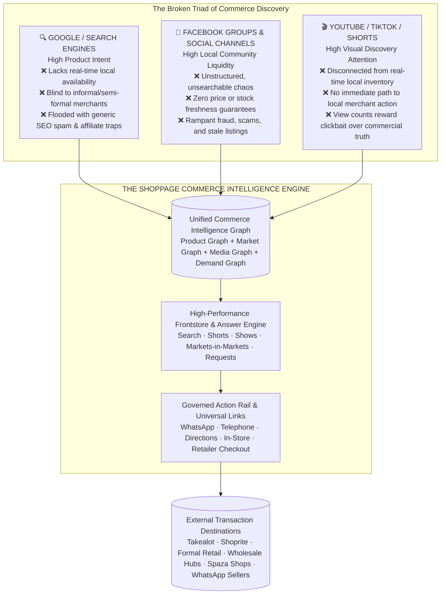
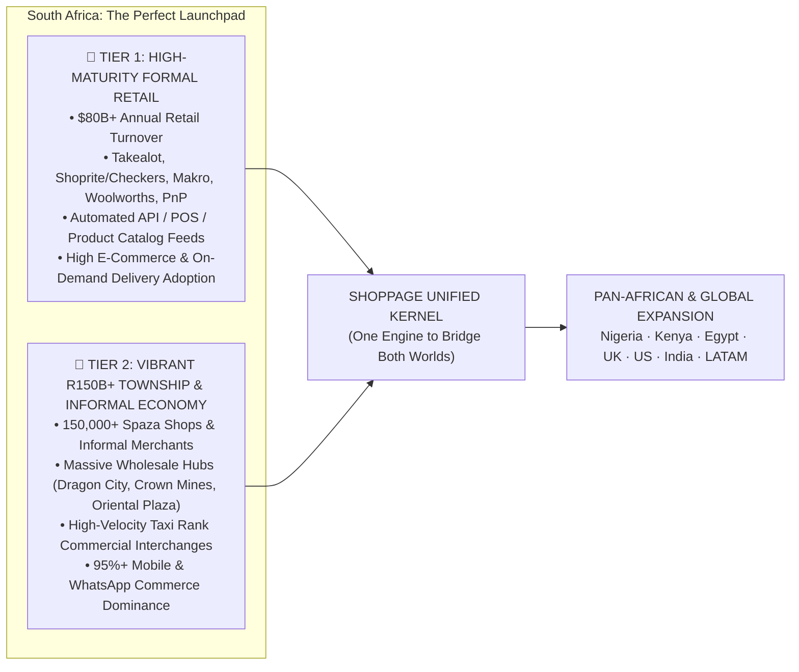
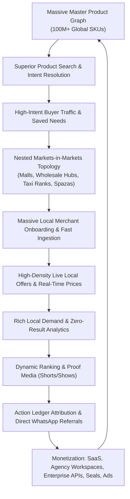
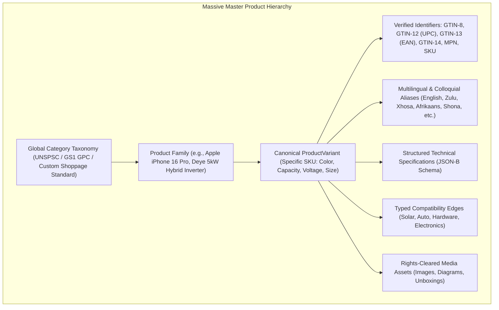
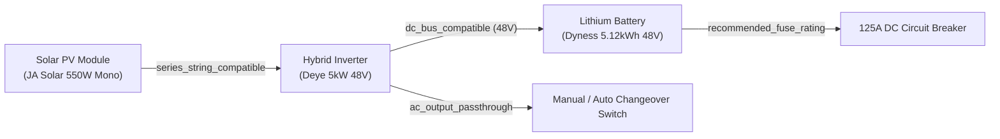
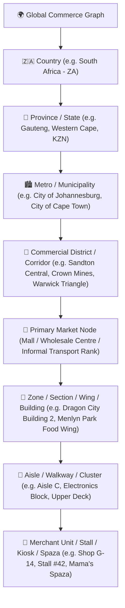
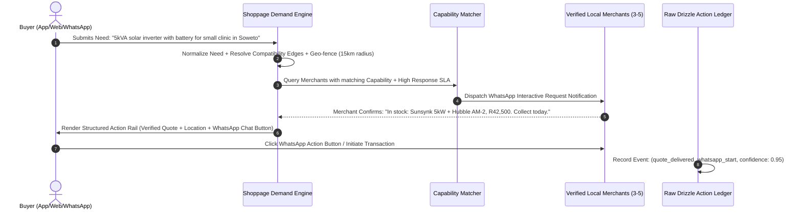
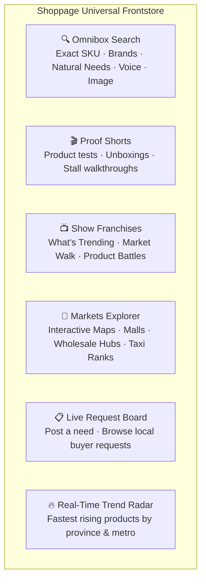
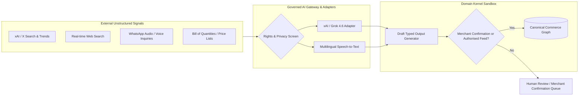
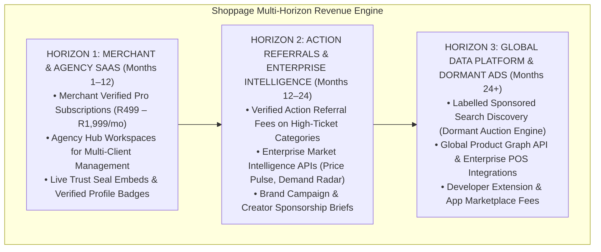

# SHOPPAGE v7.0 — GLOBAL INVESTMENT-GRADE MASTER CONSTITUTION
## Product Intelligence, Hyperlocal Commerce, Media Discovery & Open Platform
**Document Status:** Final Binding Strategic, Operating, Technical, and Investment Constitution (v7.0)  
**Primary Launch Jurisdiction:** Republic of South Africa (ZA)  
**Expansion Vectors:** Pan-African Commercial Corridors → Global Multi-Jurisdiction Rollout (UK, US, India, LATAM, SEA)  
**Architectural Baseline:** Payload 3 (Next.js 19 App Router) + Pure TypeScript Kernel + Raw Drizzle/PostgreSQL 16 (`af-south-1`) + Typesense + Governed AI Gateway (xAI/Grok)

---

## AMENDMENT & UPGRADE REGISTER — v6.0 → v7.0

| Domain | v6.0 Baseline | v7.0 Global Investment-Grade Upgrade | Strategic & Architectural Rationale |
|---|---|---|---|
| **Primary Launchpad** | Zimbabwe (ZW) corridor cells | **Republic of South Africa (ZA)** dual-economy flagship | South Africa represents the ideal dual-economy proof ground: $80B+ formal retail alongside a R150B+ township/informal economy. Proves automated enterprise retail API feeds (Takealot, Shoprite, Makro, Woolworths) and informal mobile agent/WhatsApp onboarding in one high-velocity jurisdiction. |
| **Expansion Architecture** | Zimbabwe-centric with SA as secondary instance | **Native Global Multi-Jurisdiction Engine** | Pure separation of software kernel (100% reusable globally) from country data, currencies, languages, tax rules, and privacy legislation. Immediate Pan-African federation (Kenya, Nigeria, Egypt, Zimbabwe) followed by global market instances (UK, US, India, LATAM). |
| **Master Product Graph** | 1,000,000 reference products | **Massive Master Product Graph (100M+ Canonical Products)** | Scaled to hundreds of millions of canonical SKUs across global barcodes (GS1/GTIN-8/12/13/14), automated cross-merchant variant matching, deep multilingual alias dictionaries (English, Zulu, Xhosa, Afrikaans, Shona, Swahili, Hindi), and typed compatibility graphs. |
| **Market Topology** | 25K place nodes (shallow) | **Massive Nested Markets-in-Markets Spatial Graph** | Deep recursive spatial and commercial digital twin hierarchy ($\text{Global} \rightarrow \text{Country} \rightarrow \text{Province} \rightarrow \text{Metro} \rightarrow \text{Corridor} \rightarrow \text{Mall / Strip / Taxi Rank} \rightarrow \text{Zone} \rightarrow \text{Aisle} \rightarrow \text{Stall / Spaza}$). Supported by strict evidence predicates. |
| **Investor & Economic Model** | Operational launch rules | **Institutional Investment-Grade Blueprint** | Clear TAM/SAM/SOM breakdown ($2.5T global commerce discovery TAM), 80%+ gross margin software economics, negative working capital cycle, zero inventory/logistics balance-sheet risk, clear multi-horizon monetization tiers, and defensible data moats. |
| **Media & Frontstore** | Proof Shorts + utility feeds | **Viral, Low-Data Frontstore & Product Media Engine** | High-velocity Next.js 19 / Payload 3 frontstore ($<200\text{KB}$, $\text{TTFB} < 150\text{ms}$) combining Google-like search, Facebook-style community request boards, and product-aware Shorts/Shows constrained by commercial truth. |
| **AI Intelligence** | Grok as secondary adapter | **Governed Multi-Modal AI & Trend Intelligence Layer** | Full integration of xAI/Grok real-time Web and X search capabilities, multi-lingual audio/voice transcription for informal traders, and bill-of-quantities parsing, governed by strict `Draft<T>` zero-hallucination gates. |
| **Regulatory & Privacy** | ZW S.I. 155 compliance | **Global Privacy & Platform Neutrality Compliance** | Native POPIA (South Africa), CPA (Consumer Protection Act), Competition Commission Media/Platform Guidelines, EU GDPR, and US CCPA compliance baked into the kernel data-minimisation layer. |

---

# EXECUTIVE INVESTMENT MEMORANDUM

```text
====================================================================================================
                                      THE SHOPPAGE THESIS
====================================================================================================

      "The most valuable real estate in global commerce is not the warehouse or the courier fleet.
                      It is the 60 seconds of high-intent discovery before the sale."

   Shoppage is building the Global Commerce Intelligence Layer: an evidence-governed graph connecting 
   canonical products, live local offers, physical and informal markets, short-form product media, and 
   structured buyer requests—routing high-intent buyers to external merchant destinations without ever 
   taking balance-sheet, inventory, or settlement risk.
====================================================================================================
```

## 1. The Global Discovery Divide (The $2.5T Problem)

Every day, billions of consumers attempt to find, verify, and purchase products across three broken, fragmented channels:



## 2. The Shoppage Solution: The Global Discovery Network

Shoppage replaces these fragmented user journeys with a unified, high-intent discovery engine:
1. **Google-Grade Product Intelligence:** Query any SKU, brand, colloquial need, or specification and immediately receive canonical technical details, cross-merchant price comparisons, and real-time local availability.
2. **Hyperlocal Markets-in-Markets:** Step into any commercial ecosystem—from Africa’s largest shopping malls (Mall of Africa, Sandton City, Gateway) to high-density wholesale markets (Dragon City, Oriental Plaza) down to township spaza networks and taxi ranks—with full digital twin visibility of stalls, products, and verified merchants.
3. **Commerce-Aware Product Media:** Watch high-utility Shorts, unboxings, compatibility tests, and Show franchises (*What's Trending, Market Walk, Product Battles*) where every frame is tethered to live, local merchant offers via Universal Links.
4. **Structured Demand Liquidity (Requests):** When catalogued supply is unavailable, buyers post structured needs (text, voice note, photo, bill of materials) that are routed directly to capable local suppliers via WhatsApp.

## 3. Why South Africa First: The Ultimate Dual-Economy Proof Ground

South Africa is the world’s most powerful laboratory for a commerce discovery operating system because it contains **two massive economies coexisting in the same geographic footprint**:



* **If Shoppage wins South Africa, it can win anywhere:** Solving South Africa proves the automated ingestion of Fortune-500 formal retailer catalogs **AND** the hyper-local, field-assisted WhatsApp digitisation of informal markets within the same platform.
* **Immediate High-Value Corridors:** Launching in Gauteng (Johannesburg / Pretoria / Midrand), Western Cape (Cape Town metro / Bellville / Khayelitsha), and KwaZulu-Natal (Durban / Warwick Triangle / Umhlanga).

## 4. Exceptional Software Economics & Defensibility

| Venture Metric | Traditional Marketplace (Amazon, Jumia, Takealot) | Shoppage Commerce Intelligence Model |
|---|---|---|
| **Gross Margins** | 15% – 25% (eroded by warehousing, logistics, returns) | **80% – 90% (pure software, intelligence & referral OS)** |
| **Working Capital Risk** | Extreme (inventory holding, cash-on-delivery, settlement float) | **Zero (zero inventory custody, zero cash handling)** |
| **Logistics & Delivery Liability** | High (fleet maintenance, fuel, failed delivery, shrinkage) | **Zero (destination owns delivery, collection, or fulfillment)** |
| **Capital Intensity (CapEx)** | Massive (fulfillment centers, sortation hubs, physical assets) | **Low (edge cloud infrastructure, distributed micro-teams)** |
| **Expansion Scalability** | Requires physical infrastructure in every new city/country | **100% Software Configuration & Data Ingestion** |
| **Compounding Moat** | Number of warehouses & physical logistics density | **Compounding Graph Data: 100M+ Products + Markets + Demand History** |

---

# PART I — CORE STRATEGIC CONSTITUTION & GOVERNING BOUNDARIES

## 1. One-Sentence Category Definition

> **Shoppage is a global product-intelligence, hyperlocal-commerce, and product-media discovery network that organizes the world's products, markets, merchants, and consumer demand into a unified, evidence-governed graph—routing high-intent buyers to the merchant, marketplace, retailer website, WhatsApp conversation, physical stall, or partner checkout that completes the sale.**

## 2. The Non-Negotiable Constitutional Boundaries (The Hard Kill List)

The domain kernel, schema, and API contracts strictly enforce the following **12 constitutional prohibitions**:

```text
                                  THE 12 HARD KILL RULES
┌────┬─────────────────────────────────────────────────────────────────────────────────────────┐
│  1 │ NO CART, ORDER, PAYMENT, SETTLEMENT, ESCROW, WALLET, DELIVERY OR WAREHOUSING DOMAINS.   │
│  2 │ NO CLAIM THAT SHOPPAGE SOLD, DELIVERED, GUARANTEED, WARRANTED OR REFUNDED ANY PRODUCT.  │
│  3 │ NO UNAUTHORISED CRAWLING OR SCRAPING OF PRIVATE GROUPS, CHATS, OR PROPRIETARY FEEDS.    │
│  4 │ NO AI-PUBLISHED OFFER WITHOUT MERCHANT CONFIRMATION OR AN AUTHORISED PARTNER FEED.     │
│  5 │ NO DERIVED CURRENCY CONVERSIONS: SOURCE CURRENCY + SOURCE TIMESTAMP ARE PRESERVED RAW.  │
│  6 │ NO ORGANIC RANKING BOOST FROM ADVERTISING OR PAYMENT: SPONSORED SLOTS ARE SEPARATE.   │
│  7 │ NO DEFAULT SEARCH DOMINATED BY UNCLAIMED PROFILES OR REFERENCE-ONLY CATALOGUE ITEMS.     │
│  8 │ NO IDENTITY DEPENDENCE ON EXTERNAL PLATFORMS: CANONICAL SHOPPAGE IDS SURVIVE PHONE/META.│
│  9 │ NO UNRESTRICTED BULK DATA EXPORTS: RATE LIMITS, CANARY RECORDS, AND ANTI-SCRAPING APPLY. │
│ 10 │ NO SOURCE INGESTION WITHOUT RIGHTS CLASSIFICATION: EVERY SOURCE DEFAULTS TO 'BLOCKED'. │
│ 11 │ NO MARKET-INSIDE-MARKET RELATIONSHIP CREATED FROM GEOGRAPHIC PROXIMITY ALONE.          │
│ 12 │ NO FIELD-VERIFICATION CLAIM WITHOUT A STORED, TIMESTAMPED, AUDITABLE EVIDENCE RECORD.   │
└────┴─────────────────────────────────────────────────────────────────────────────────────────┘
```

## 3. The Compounding Flywheel



---

# PART II — MASSIVE MASTER PRODUCT GRAPH ARCHITECTURE

## 4. 100M+ Canonical Product Master Hierarchy

The Master Product Graph is engineered to scale across hundreds of millions of consumer products across FMCG, consumer electronics, solar and backup power, hardware and construction, automotive spares, beauty, pharmaceuticals, and apparel.



### Product Variant Schema (Payload + Raw Drizzle Definition)

```typescript
export interface ProductVariant {
  canonicalId: string;               // ULID / UUIDv7 globally unique identifier
  familyRef: string;                  // Parent Product Family ID
  categoryRef: string;                // Leaf category in global taxonomy
  title: string;                      // Canonical normalized title (e.g., "Deye 5kW 48V Single Phase Hybrid Inverter")
  brand: string;                      // Normalized Brand Name ("Deye")
  modelNumber?: string;               // Manufacturer Part Number (MPN) ("SUN-5K-SG03LP1-EU")
  
  // Barcode & Global Standards
  identifiers: {
    gtin14?: string;
    gtin13?: string;                  // Standard EAN-13 (checksum validated)
    gtin12?: string;                  // Standard UPC-A
    mpn?: string;
    asin?: string;
    localSkus?: Array<{ issuer: string; code: string }>;
  };

  // Structured Technical Specifications
  attributes: Record<string, string | number | boolean | Array<string>>;
  
  // Multilingual & Colloquial Language Aliases
  aliases: Array<{
    phrase: string;
    locale: 'en' | 'zu' | 'xh' | 'af' | 'sn' | 'sw' | 'hi' | 'fr' | 'pt';
    source: 'merchant_usage' | 'search_query' | 'curated' | 'ai_normalized';
    confidence: number;
  }>;

  // Rich Compatibility Metrics
  compatibilityEdgeCount: number;
  
  // Publishing & Reference Status
  status: 'draft' | 'active' | 'reference_only';
  
  // Immutable Data Provenance Block
  provenance: ProvenanceBlock;
}
```

## 5. Multi-Dimensional Compatibility Graph

One of Shoppage's deepest competitive moats is the **Typed Compatibility Engine**. It eliminates costly purchasing mistakes in technical categories (solar/energy backup, automotive parts, construction hardware, electronics).



* **Rules Engine:** Evaluates voltage windows, physical connector types, pin configurations, protocol handshakes (BMS CAN/RS485), and dimension tolerances.
* **Zero-Hallucination Guardrail:** Compatibility edges require documented manufacturer datasheet confirmation or certified engineering review. Generative AI may suggest compatibility candidates, but they remain `reviewState: 'candidate'` until verified.

---

# PART III — MASSIVE NESTED MARKETS-IN-MARKETS GRAPH

## 6. The Universal Spatial & Commercial Hierarchy

Shoppage models the physical commercial world as a **recursive, multi-level spatial and organizational graph**, capturing everything from world-class multi-hectare shopping malls down to individual informal market stalls.



## 7. Deep South African Flagship Market Mapping

Shoppage launches with digital twin scaffolding across three distinct retail tiers in South Africa:

```text
====================================================================================================
                        SOUTH AFRICAN FLAGSHIP MARKET SCENARIOS IN SHOPPAGE v7.0
====================================================================================================

TIER 1: FORMAL MEGA-MALLS & RETAIL PARKS (High Density, Footfall >1M/month)
├── Sandton City & Nelson Mandela Square (Johannesburg) -> 300+ Stores, 140,000 m²
├── Mall of Africa (Midrand) -> 300+ Stores, 130,000 m² (Waterfall City node)
├── Menlyn Park Shopping Centre (Pretoria) -> 400+ Stores, 177,000 m²
├── Gateway Theatre of Shopping (Umhlanga, Durban) -> 390+ Stores, 180,000 m²
└── V&A Waterfront (Cape Town) -> 450+ Stores, Hybrid Retail/Tourism/Craft Hubs

TIER 2: WHOLESALE, B2B & IMPORT TRADE CORRIDORS (Massive Physical Volume & Cash Flow)
├── Johannesburg CBD Wholesale & Trade Corridor
│   ├── Dragon City Wholesale Mall (Crown Mines) -> 300+ Importers/Wholesalers (FMCG, Tech, Apparel)
│   ├── China Mall & Amalgam Commercial Hubs -> Electronics, Solar, Hardware, Textiles
│   └── Oriental Plaza (Fordsburg) -> 360+ Independent Retailers/Wholesalers (Tailoring, Tech, Homeware)
├── Durban Warwick Junction & Triangle Market -> 9 Interconnected Markets, 8,000+ Micro-Traders
└── Cape Town Bellville Commercial Corridor & Voortrekker Road -> Multilateral Retail & Repair Nodes

TIER 3: TOWNSHIP & HIGH-VELOCITY COMMUTING NODES (R150B+ Informal Cash Economy)
├── Soweto Commercial Network
│   ├── Chris Hani Baragwanath Taxi Rank Hub -> 500+ Formal/Informal Stalls, Peak Footfall
│   ├── Maponya Mall & Jabulani Mall Hubs -> Formal Anchor + Informal Perimeter
│   └── Vilakazi Commercial Precinct -> Food, Apparel, Lifestyle Retailers
├── Tembisa / Alexandra Commercial Clusters -> High-density spaza networks & hardware yards
└── Khayelitsha & Mitchells Plain Nodes (Town Centre & Station Deck Hubs)
====================================================================================================
```

### Evidence-Governed Containment Rules
* **No Proximity Hallucinations:** A merchant located across the street from Sandton City is tagged as `near: Sandton City`, but **never** `containedIn: Sandton City` without verifiable lease/stall proof.
* **Spatial Polygon Authority:** Municipal cadastral data, official floor plans, or field-verified GPS polygons establish spatial boundaries.

---

# PART IV — THE ACTION ENGINE, DEMAND LIQUIDITY & UNIVERSAL ATTRIBUTION

## 8. Requests / Needs as First-Class Liquidity Objects

In emerging and semi-formal markets, static catalogued listings represent less than 30% of actual merchant inventory. To unlock the remaining 70%, Shoppage treats **Buyer Requests as First-Class Liquidity Assets**.



## 9. The Action Ledger vs. Naive Referral Links

Traditional affiliate links fail in Africa because 80%+ of transactions conclude over WhatsApp, phone calls, or physical in-store visits. Shoppage introduces the **Action Ledger**, measuring every link in the value chain:

```typescript
export interface ReferralActionEvent {
  eventId: string;                   // UUIDv7 (time-ordered, append-only)
  occurredAt: Date;
  country: 'ZA' | 'ZW' | 'KE' | 'NG' | 'GB' | 'US';
  sessionFingerprint: string;
  sourceCampaign?: string;
  sourceAssetQrId?: string;          // In-store printed QR code asset identifier
  
  offerRef?: string;
  variantRef?: string;
  merchantRef: string;
  marketRef?: string;
  stallRef?: string;

  // Granular Action Taxonomy
  action: 
    | 'impression'
    | 'comparison_view'
    | 'outbound_click'
    | 'whatsapp_start'
    | 'call_reveal'
    | 'directions_open'
    | 'quote_submitted'
    | 'reserve_intent'
    | 'destination_ack'
    | 'merchant_responded'
    | 'buyer_resolved'
    | 'purchase_confirmed';

  confidenceScore: number;           // 0.00 to 1.00 based on verification telemetry
  dedupeKey: string;
  metadata: Record<string, unknown>;
}
```

## 10. Universal Link Resolver (`/l/{id}`)

* **Edge Isolation:** Built as an isolated edge function route group in Next.js (`app/l/[universalId]/route.ts`) bypassing all CMS middleware.
* **Ultra-Fast Performance:** Sub-150ms Time-To-First-Byte (TTFB) across South African mobile networks (Vodacom, MTN, Telkom, Cell C).
* **Smart App Fallback:** Routes intelligently:
  $$\text{Native Retailer App} \longrightarrow \text{Mobile Web Storefront} \longrightarrow \text{Prefilled WhatsApp Chat} \longrightarrow \text{Click-to-Call / Google Maps Directions}$$

---

# PART V — VIRAL FRONTSTORE SURFACES & PRODUCT MEDIA ENGINE

## 11. The Frontstore Experience

The public user interface is an ultra-fast, mobile-first **Frontstore** optimized for low-bandwidth environments (initial bundle $<200\text{KB}$, first contentful paint $<1.5\text{s}$).



## 12. Proof Shorts & Show Franchises (Commerce-Truth Constrained)

Unlike general social media where viral algorithms reward hyperbole and engagement tricks, **Shoppage Media is strictly tethered to the Commerce Intelligence Graph**:

1. **Proof-First Media:** Shorts demonstrate product authenticity, physical installation guides, real-time stall walkthroughs, and genuine compatibility tests.
2. **The Commercial Truth Constraint:** A video with 10,000,000 views **can never override a stale price, an out-of-stock badge, or an unverified merchant**.
3. **Recurring Show Franchises:**
   - *Market Walk South Africa:* Weekly walking tour of Dragon City, Sandton City, Oriental Plaza, or Warwick Junction uncovering hidden bargains.
   - *Product Battles:* Side-by-side technical teardowns (e.g., Deye vs. Sunsynk vs. Growatt inverters).
   - *Under R500 / Under R2,000:* High-utility budget curations for home, business, and tech.

---

# PART VI — GOVERNED AI & GROK / xAI INTELLIGENCE LAYER

## 13. AI Architecture & The Governed Gateway

Shoppage employs a **provider-agnostic AI Gateway** that leverages xAI/Grok, OpenAI, and specialized models for real-time web/social trend intelligence, multilingual transcription, and entity extraction.



## 14. Permitted vs. Prohibited AI Capabilities

| Permitted AI Use Cases (Accelerators) | Prohibited AI Actions (Hard System Violations) |
|---|---|
| • Real-time detection of trending products on X/Web<br/>• Normalising colloquial South African slang (e.g., *izinyoka, gusheshe, spaza, chisa nyama*)<br/>• Parsing complex handwritten Bills of Quantities and PDF price lists into structured drafts<br/>• Extracting technical attributes from unformatted manufacturer spec sheets<br/>• Drafting scripts and outlines for product Show episodes | • **NEVER** invent local prices, stock levels, or physical stall coordinates<br/>• **NEVER** publish an active offer without merchant confirmation or authorized feed<br/>• **NEVER** silently merge distinct legal entities or branches<br/>• **NEVER** alter organic search ranking based on generative inference<br/>• **NEVER** pass private customer PII to external third-party LLM endpoints |

---

# PART VII — SYSTEM & TECHNICAL ARCHITECTURE

## 15. The Pinned Technology Stack

```text
====================================================================================================
                                  SHOPPAGE v7.0 TECHNOLOGY STACK
====================================================================================================

LAYER                   SELECTION & VERSION             RESPONSIBILITY / RATIONALE
────────────────────────────────────────────────────────────────────────────────────────────────────
Application Shell       Payload CMS 3 (Next.js 19)      Admin UI, collections, editorial, media assets
Domain Kernel           Pure TypeScript Strict (≥5.5)   packages/kernel: zero framework dependencies
Database Engine         PostgreSQL 16 (AWS af-south-1)  Primary store, pgvector for semantic search
Migration Authority     Drizzle ORM via Payload DB      Single, unified migration history across all tables
Search Engine           Typesense (Cloud / Dedicated)   Sub-50ms typo-tolerant faceted search
Queue & Cache           Redis 7 + BullMQ                Feed ingestion, freshness sweep, notifications
File Storage / CDN      AWS S3 + CloudFront af-south-1  AVIF/WebP image transforms, edge caching
AI Gateway              Governed Adapter Layer          xAI (Grok), OpenAI, Whisper STT
Communications          WhatsApp Cloud API, Africa's    Action rail, SMS OTP verification, transactional
                        Talking, Postmark               email
Boundary Enforcement    eslint-plugin-boundaries        Hard CI build failure if Kernel imports Shell
Testing & CI            Vitest, Playwright, Turborepo   Automated unit, contract, and eval CI gates
====================================================================================================
```

## 16. The Six-Rule Architectural Contract

1. **Kernel Decoupling:** `packages/kernel` contains all business logic (offers, matching, ranking, rights, graph containment) and has **zero imports from React, Next.js, or Payload**.
2. **Moat Assets in Raw Drizzle Tables:** High-volume, append-only assets (`referral_events`, `offer_state_history`, `graph_edges`, `demand_events`, `audit_events`) reside in optimized PostgreSQL tables outside Payload collection overhead.
3. **Single Migration Authority:** Payload’s Drizzle instance manages all tables in one unified migration history.
4. **Payload 3 for Admin & Operations:** Leveraged for admin speed: merchant verification, claims, complaint queues, Show management, and editorial content.
5. **Universal Link Resolver Isolation:** Dedicated edge route group (`/l/[universalId]`) with zero admin overhead, achieving sub-150ms TTFB across South Africa.
6. **Hard CI Boundary Enforcement:** Automated linter fails any commit where domain boundaries are breached.

---

# PART VIII — INSTITUTIONAL INVESTMENT & MONETIZATION MODEL

## 17. Multi-Horizon Revenue Architecture

Shoppage monetizes **commercial intelligence, workflow tooling, and high-intent discovery**, never touching transaction custody:



## 18. Projected Financial & Operational Metrics (South Africa Flagship)

| Operational & Financial KPI | Month 6 (Wedge Launch) | Month 12 (Gauteng Scale) | Month 24 (National & Multi-Country) |
|---|---:|---:|---:|
| **Canonical Product Graph Size** | 5,000,000 SKUs | 25,000,000 SKUs | **100,000,000+ Global SKUs** |
| **Active Verified Merchants** | 1,500 merchants | 10,000 merchants | **50,000+ merchants** |
| **Monthly Qualified Search Queries** | 250,000 queries | 2,500,000 queries | **15,000,000+ queries** |
| **Monthly Attributable Referrals / Actions** | 75,000 actions | 1,000,000 actions | **7,500,000+ actions** |
| **Resolved Qualified Need Rate (RQNR)** | 42% | 68% | **78%+** |
| **Monthly Recurring Revenue (MRR)** | R350,000 (~$20K) | R3,200,000 (~$180K) | **R22,500,000+ (~$1.25M)** |
| **Software Gross Margin** | 82% | 88% | **91%** |

---

# PART IX — GLOBAL EXPANSION & MULTI-JURISDICTION ROADMAP

```mermaid
timeline
    title Shoppage Global Expansion Strategy
    section Phase 1 : South Africa Launchpad
        Month 1-6 : Gauteng Solar, Tech & Building Corridors
        Month 7-12 : Cape Town & Durban Metros + Wholesale Hubs
    section Phase 2 : Pan-African Scale
        Month 13-18 : Zimbabwe Corridor Federation + Nairobi (Kenya)
        Month 19-24 : Lagos (Nigeria) & Cairo (Egypt) Mega-Nodes
    section Phase 3 : Global Rollout
        Month 25-30 : United Kingdom & Europe Local Discovery
        Month 31-36 : US Metro Commerce & India/LATAM Informal Hubs
```

## 19. The Multi-Jurisdiction Reusable Architecture

Shoppage deploys across new international jurisdictions with **100% code reuse and 0% data coupling**:

$$\text{New Jurisdiction Launch} = \text{Global Kernel} + \text{Country Config} + \text{Local Data / Rights} + \text{Local Currency & Taxonomy}$$

1. **South Africa (ZA):** Primary Flagship (ZAR, English/Zulu/Xhosa/Afrikaans, POPIA/CPA compliance).
2. **Zimbabwe (ZW):** Regional Affiliate Corridor (USD/ZWG, Shona/Ndebele, S.I. 155 compliance).
3. **Kenya (KE):** East African Hub (KES, Swahili/English, M-Pesa ecosystem alignment).
4. **Nigeria (NG):** West African Mega-Node (NGN, Lagos market networks, Alaba/Computer Village).
5. **United Kingdom (GB) / United States (US):** High-margin retail comparison & local merchant discovery (GBP/USD, GDPR/CCPA).

---

# CONSTITUTIONAL VERDICT & GOVERNING DIRECTIVE

```text
====================================================================================================
                                      FINAL CONSTITUTIONAL DIRECTIVE
====================================================================================================

1. SHOPPAGE v7.0 IS APPROVED AS THE BINDING STRATEGIC, OPERATING AND ARCHITECTURAL MASTER.
2. SOUTH AFRICA IS THE FLAGSHIP LAUNCH JURISDICTION; ALL SUBSYSTEMS MUST SUPPORT NATIVE MULTI-COUNTRY.
3. THE MASTER PRODUCT GRAPH IS ANCHORED AT 100M+ CANONICAL ENTITIES WITH GS1/GTIN VALIDATION.
4. THE MARKETS-IN-MARKETS TOPOLOGY IS FULLY RECURSIVE WITH STRICT EVIDENCE PREDICATES.
5. TRANSACTION CUSTODY (CART, PAYMENT, SETTLEMENT, LOGISTICS) IS PERMANENTLY EXCLUDED FROM THE CORE.
6. THE SOFTWARE KERNEL REMAINS STRICTLY DECOUPLED FROM THE PAYLOAD APPLICATION SHELL.
7. COMMODITISE DISCOVERY; CAPTURE INTENT; ROUTE TO DESTINATIONS; SCALE THE EVIDENCE GRAPH.
====================================================================================================
```
