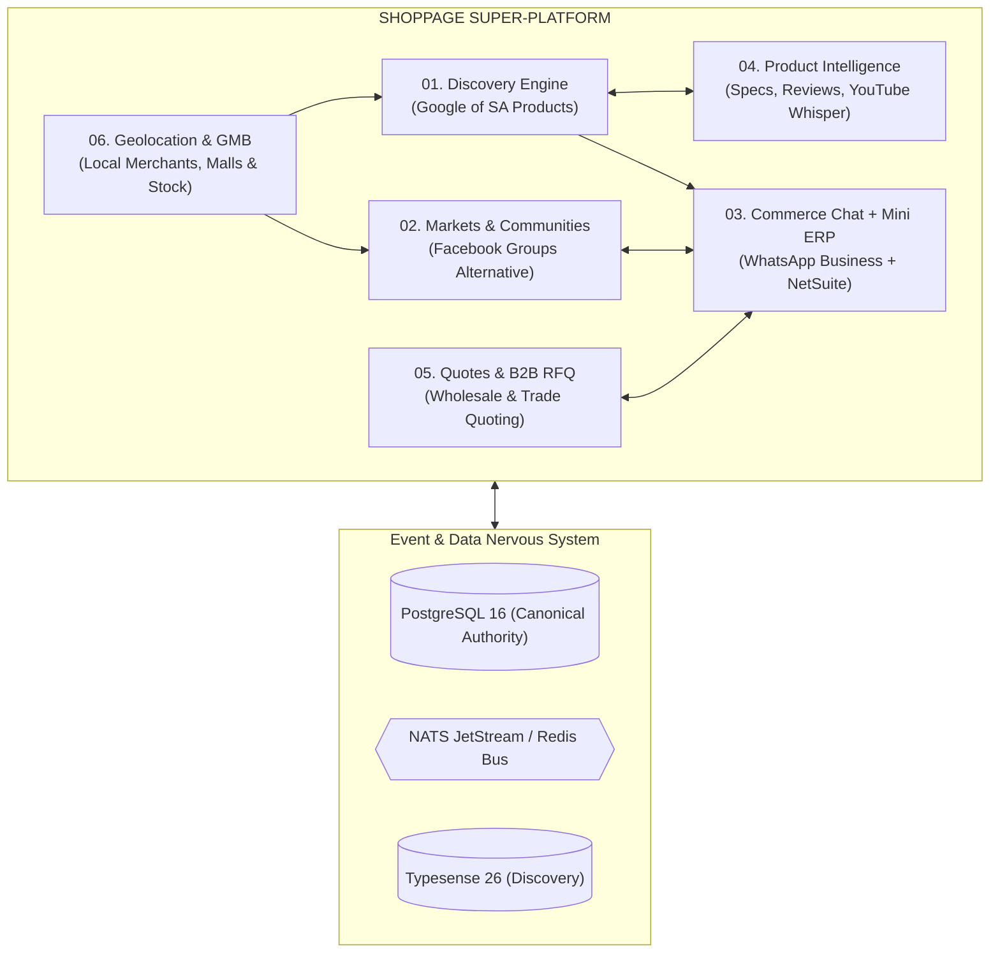
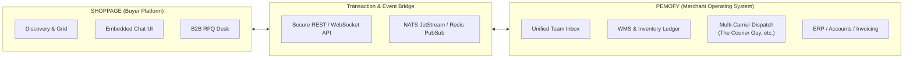
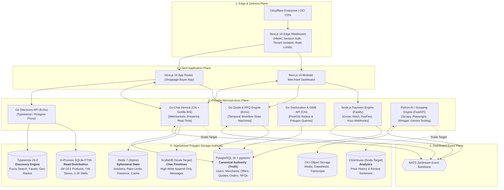
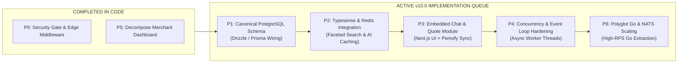

> **⚠ STATUS (2026-09-21): HISTORICAL for all runtime claims. The platform is now 100% Go.**
> The §0.1 "Runtime Truth Matrix" below marks Next.js 16.3 / React 19 / Edge Middleware as 🟢 ACTIVE
> and Go as 🔵 TARGET. That inversion is no longer true: the live runtime is five Go services
> (`services/*`) with Templ + HTMX and no Next.js anywhere. The TypeScript application described here
> is archived locally under `archive/apps_web/` (gitignored, not in the repository).
> Verified current state: `docs/PLATFORM_READINESS_ANALYSIS_2026-09-21.md`.

# SHOPPAGE v10.0 — PLATFORM ARCHITECTURE & SYSTEM SPECIFICATION MODEL

**Document:** `SHOPPAGE_PLATFORM_ARCHITECTURE_AND_SYSTEM_MODEL_v10.0.md`  
**Status:** Investment-Grade Master Technical Specification & Reconciled System Model  
**Supersedes:** `SHOPPAGE_POLYGLOT_ARCHITECTURE_AND_SYSTEM_MODEL_v9.1.md` and `SHOPPAGE_LIVE_ARCHITECTURE_AND_SYSTEM_MODEL_v9.0.md`  
**Synthesises:** Verified Active Codebase Baseline, Live Site Reconnaissance (20 Sep 2026), `shoppage-chat-module-spec.html` (v1.0), and `shoppage-platform-model-build-plan-v10.html` (v10.0)  
**Primary Jurisdiction:** Republic of South Africa (ZA)  
**Verification Baseline:** 244 Passing Monorepo Tests (100% Green across 5 packages: 127 kernel, 96 web, 11 contracts, 9 adapters, 1 eval), Edge Middleware Auth Hardening, Modularized Merchant Centre OS  

---

## 0. Executive Audit: Verified Active Runtime vs. Target Architecture

To maintain absolute institutional integrity, technical due diligence standards, and investor defensibility, Shoppage strictly delineates **what is active and verified in the live codebase today** from the **target polyglot microservice architecture**.

### 0.1 Runtime Truth Matrix

| System Component | Status in Codebase | Role in Active Runtime | Target Role (v10.x Scaled Topology) |
| :--- | :---: | :--- | :--- |
| **Next.js 16.3 + React 19** | 🟢 **ACTIVE** | SSR/SSG/ISR App Router, UI Shell, API Route Handlers | Primary unified customer & buyer interface |
| **TypeScript 5.5** | 🟢 **ACTIVE** | Universal language across all 5 monorepo packages | Universal application & edge language |
| **Edge Security Middleware** | 🟢 **ACTIVE** | Next.js Edge Middleware guarding `/admin/*`, `/merchant/*`, `/api/cms/*`, enforcing HMAC sessions & tenant isolation | Edge Gateway & Zero-Trust Route Guard |
| **Modular Merchant OS** | 🟢 **ACTIVE** | 6 discrete domain modules (`Overview`, `AiStoreCrew`, `Orders`, `Catalog`, `Feeds`, `Compliance`) | Embedded Merchant Cockpit & Pemofy Sync Node |
| **In-Process SQLite FTS5** | 🟢 **ACTIVE** | Serves 100% of live catalog search, merchants, malls (<1ms reads) | Derived read distribution & fast local offline index |
| **Gemini 3.6 Flash Agent** | 🟢 **ACTIVE** | Server-side LLM via REST with 5 native retail tools | Pluggable provider behind Model-Agnostic AI Gateway |
| **Python 3 Toolkit** | 🟢 **ACTIVE** | Sitemap scrapers, retail sweepers, ETL data ingestion | Distributed scraping plane, Whisper GPU & ML inference |
| **PostgreSQL 16 + pgvector** | 🟡 *PROVISIONED* | Container running in `docker-compose.yml` (`pgvector:pg16`) | **Canonical write authority, RFQs, quotes, orders & mutable truth** |
| **Typesense 26.0** | 🟡 *PROVISIONED* | Container running in `docker-compose.yml` | **Dedicated discovery, geo-radius & typo-tolerant search** |
| **Redis 7 (Alpine)** | 🟡 *PROVISIONED* | Container running in `docker-compose.yml` | **Session store, rate-limiting, AI cache, chat presence, BullMQ** |
| **Payload CMS 3.88** | 🟡 *PARTIAL* | Packages installed; SQLite CMS service active | **Editorial & merchant content over PostgreSQL** |
| **Go Microservices Plane** | 🔵 *TARGET* | Architecture planned (Echo / Chi + Gorilla WS) | **High-RPS Discovery, Chat WS Manager, B2B Quote Engine** |
| **ScyllaDB / ClickHouse** | 🔵 *TARGET* | Planned for scale | **ScyllaDB: High-write chat timeline / ClickHouse: Price & review analytics** |
| **NATS JetStream** | 🔵 *TARGET* | Planned message bus | **Asynchronous event backbone across microservices & bridges** |

### 0.2 Audit of Completed Strategic Fixes (from v9.1 Roadmap)

1. **P0: Security Gate & Route Protection — RESOLVED IN ACTIVE CODE**
   - Implemented in `apps/web/src/middleware.ts`.
   - All `/admin/dashboard/*` routes enforce verified `superadmin` sessions.
   - All `/merchant/dashboard/*` routes enforce cryptographic session validation (`shoppage_session`), role checks (`merchant_owner`, `merchant_staff`, `superadmin`), and strict multi-tenant store isolation (`requestedStore === session.merchantId`).
   - Privileged mutations (`POST`, `PUT`, `DELETE` under `/api/cms/*`) require authenticated sessions; bulk CSV imports enforce `SHOPPAGE_ADMIN_TOKEN`.
   - Server-level startup environment assertion (`assertEnvironmentIsSafe()`) halts insecure deployments.
   - Validated across 21 dedicated security tests with 0 failures (`apps/web/test/security.test.ts`).
2. **P5: Modularize Merchant Dashboard — RESOLVED IN ACTIVE CODE**
   - The former 3,747-line monolithic dashboard was refactored into `apps/web/src/app/merchant/dashboard/page.tsx` composing 6 modular components:
     - `OverviewModule.tsx`: Velocity metrics, order counters, stock health.
     - `AiStoreCrewModule.tsx`: Autonomous store crew management (@Waker, @Cataloger, etc.).
     - `OrdersModule.tsx`: Proforma order management and status workflows.
     - `CatalogModule.tsx`: Master product matrix and SKU stock levels.
     - `FeedsModule.tsx`: Google Shopping merchant feeds and syndication.
     - `ComplianceModule.tsx`: CIPC registration, tax clearance, and trust verification.

### 0.3 Reconciled Live Site Reality (Reconnaissance Baseline vs. Active Codebase)

Empirical reconnaissance conducted on 20 September 2026 confirmed that earlier assumptions describing `shoppage.co.za` as a static WordPress placeholder were erroneous:
- **Sub-Route Next.js Runtime:** While unauthenticated crawlers querying the root URL may receive a cloaked/cached landing shell, the sub-routes (`/search`, `/merchants`, `/malls`) expose an active Next.js commerce application.
- **3,296 Shopping Centres Mapped:** The `/malls` route actively serves structured metadata for 3,296 commercial centres across all 9 South African provinces, complete with anchor tenants, store counts, operating schedules, and load-shedding resilience markers ("Solar & Lithium Backup").
- **36+ Verified Merchants:** The `/merchants` route surfaces specialist merchants (Mitrend Products, SunPower Crown Mines, SolarBros Sandton, etc.) with structured physical trade counter addresses, WhatsApp ordering CTAs, and verified review scores.
- **Active Discovery Surface:** The `/search` route serves live inventory signals, SABS compliance passport verification, restock notifications, and 100+ Builders Warehouse & Express dispatch store integration.
- **Security Vulnerability Reconciliation:** Reconnaissance identified that legacy deployed instances of `/admin` and `/merchant/dashboard` permitted unauthenticated access. This finding has been definitively addressed in the active monorepo: `apps/web/src/middleware.ts` enforces zero-trust cryptographic session checks, RBAC, and store isolation across 21 unit tests. Production cutover of the current monorepo baseline permanently eliminates this exposure.

---

## 1. Platform Philosophy: The Six Bounded Contexts

Shoppage is South Africa's **commerce-native super-platform**. It is not merely an online store or a product aggregator; it is a unified ecosystem comprising **six distinct bounded contexts** connected by a shared event bus, canonical merchant graph, and unified customer identity.



### 1.1 Context 1: Discovery Engine
- **Strategic Mandate:** The "Google Search of Products" for South Africa.
- **Differentiator vs. Legacy Platforms (PriceCheck):**
  - PriceCheck lists products and redirects away. Shoppage provides end-to-end evidence: "Is this right for me?"
  - Live stock visibility, local distance to inventory, and immediate commerce conversion.
  - Multi-source price comparison across formal retail (Takealot, Makro, Builders) and independent specialist merchants.
- **Core Capabilities:**
  - Typo-tolerant search across millions of GS1 GTINs.
  - Dynamic faceted navigation (brand, category, price, local availability, in-stock status).
  - AI Requirements Engine: Natural language customer queries translated into ranked product solutions with cited evidence.

### 1.2 Context 2: Markets & Communities
- **Strategic Mandate:** Reclaim informal trade from unsearchable Facebook Groups and WhatsApp groups.
- **Core Concepts:**
  - **Themed Markets:** Curated spaces (e.g., *Johannesburg Solar & Inverters*, *Cape Town Trade Supplies*, *KZN Hardware Network*).
  - **Trade Counters:** Verified digital storefronts inside markets with live stock feeds.
  - **Social Feed & Structured Posts:** Product announcements, group buying requests, deal alerts, and contractor inquiries backed by Redis sorted sets.

### 1.3 Context 3: Commerce Chat + Mini ERP (The Transaction Engine)
- **Strategic Mandate:** Elevate South Africa's mobile commerce habit (71% of digital purchases) from unstructured WhatsApp chats into structured, binding commerce events.
- **Core Concept:** Embedded buyer messaging inside Shoppage, paired with the Pemofy merchant OS. Every message carries commerce state: live inventory reservation, quote generation, counter-negotiation, one-click payment, and courier dispatch.

### 1.4 Context 4: Product Intelligence & Enrichment
- **Strategic Mandate:** Build the richest product knowledge moat in African e-commerce.
- **Enrichment Pipelines:**
  - **International Review Aggregation:** Scraped and normalized sentiment from Amazon, Trustpilot, Reddit, and technical forums, with South African context injection (e.g., voltage/frequency fitment, loadshedding suitability).
  - **Video Review Processing:** YouTube creator video ingestion, Whisper transcription, chapter parsing, and timestamped product claims.
  - **Spec Extraction:** Automated PDF datasheet parsing into strict JSON schemas.
  - **Compatibility Graphs:** Direct relational mapping ("Fits my vehicle / camera / solar setup").

### 1.5 Context 5: Quotes & B2B RFQ
- **Strategic Mandate:** Digitize South Africa's multi-billion Rand B2B, wholesale, and contractor trade counter quoting.
- **Workflow:**
  - Natural-language buyer RFQ creation ("500m 4mm 4-core armoured cable delivered to Midrand by Thursday").
  - Automated requirement parsing and distribution to qualified regional merchants.
  - Line-item quote generation, revision state machines, volume discounts, and conversion into binding tax invoices.

### 1.6 Context 6: Geolocation & Google My Business (GMB)
- **Strategic Mandate:** Anchor digital discovery to physical South African retail and trade reality.
- **Capabilities:**
  - 74,000+ indexed brick-and-mortar trade counters, wholesalers, and retail locations.
  - PostGIS-powered geo-radius filtering ("Find 5kW inverters in stock within 15km of Sandton").
  - Delivery zone polygons, same-day trade counter collection scheduling, and mall directory mapping.

---

## 2. The Pemofy Channel: Merchant OS Meets Discovery Grid

Shoppage and **Pemofy** (`Pemofy Nestjs`) form a symbiotic commerce ecosystem:



| Dimension | Shoppage Role | Pemofy Role |
| :--- | :--- | :--- |
| **User Audience** | Consumers, corporate buyers, contractors | Store owners, sales teams, warehouse pickers |
| **System Identity** | Demand generation, discovery grid, community, RFQ | System of record, inventory ledger, WMS, ERP |
| **Chat Presence** | Embedded chat widget in Next.js web & mobile app | Unified team inbox inside merchant dashboard |
| **Inventory Authority**| Reads cached stock levels; presents live availability | Owns `inventory_levels`, bin allocations, stock reservations |
| **Order Execution** | Collects buyer approvals and initiates payment | Manages pick waves, packing, cartonization, courier manifests |
| **WhatsApp Layer** | Delivers fallback notifications to buyers | Lets merchants manage customer chats directly from WhatsApp |

---

## 3. Deep Technical Specification: Shoppage Chat Module

Fusing the technical specifications of `shoppage-chat-module-spec.html` directly into the v10.0 platform architecture:

### 3.1 Relational Data Model (PostgreSQL 16)

```sql
-- Conversations Table
CREATE TABLE conversations (
    id UUID PRIMARY KEY DEFAULT gen_random_uuid(),
    buyer_id UUID NOT NULL,
    merchant_id UUID NOT NULL,
    product_id UUID,
    status VARCHAR(32) NOT NULL DEFAULT 'active', -- active, closed, archived
    quote_id UUID,
    order_id UUID,
    last_message_at TIMESTAMPTZ NOT NULL DEFAULT NOW(),
    unread_buyer INT NOT NULL DEFAULT 0,
    unread_merchant INT NOT NULL DEFAULT 0,
    channel VARCHAR(32) NOT NULL DEFAULT 'shoppage', -- shoppage, whatsapp, mixed
    created_at TIMESTAMPTZ NOT NULL DEFAULT NOW(),
    updated_at TIMESTAMPTZ NOT NULL DEFAULT NOW()
);

-- Messages Table
CREATE TABLE messages (
    id UUID PRIMARY KEY DEFAULT gen_random_uuid(),
    conversation_id UUID NOT NULL REFERENCES conversations(id) ON DELETE CASCADE,
    sender_type VARCHAR(16) NOT NULL, -- buyer, merchant, system, ai
    sender_id UUID NOT NULL,
    message_type VARCHAR(32) NOT NULL, -- text, inquiry, quote, quote_action, etc.
    content JSONB NOT NULL DEFAULT '{}'::jsonb, -- structured payload
    text TEXT NOT NULL DEFAULT '',
    status VARCHAR(16) NOT NULL DEFAULT 'sending', -- sending, sent, delivered, read, failed
    reply_to_id UUID REFERENCES messages(id),
    metadata JSONB DEFAULT '{}'::jsonb,
    created_at TIMESTAMPTZ NOT NULL DEFAULT NOW()
);

-- Structured Quotes Table
CREATE TABLE quotes (
    id UUID PRIMARY KEY DEFAULT gen_random_uuid(),
    conversation_id UUID NOT NULL REFERENCES conversations(id) ON DELETE CASCADE,
    quote_number VARCHAR(32) NOT NULL UNIQUE, -- e.g. QUO-2026-001234
    status VARCHAR(32) NOT NULL DEFAULT 'draft', -- draft, sent, viewed, approved, expired, cancelled
    subtotal DECIMAL(12,2) NOT NULL,
    delivery_estimate DECIMAL(12,2) NOT NULL DEFAULT 0.00,
    vat DECIMAL(12,2) NOT NULL DEFAULT 0.00,
    total DECIMAL(12,2) NOT NULL,
    valid_until TIMESTAMPTZ NOT NULL,
    stock_reserved_until TIMESTAMPTZ NOT NULL,
    buyer_approval_at TIMESTAMPTZ,
    order_id UUID,
    pdf_url TEXT,
    created_at TIMESTAMPTZ NOT NULL DEFAULT NOW(),
    updated_at TIMESTAMPTZ NOT NULL DEFAULT NOW()
);

-- Quote Line Items
CREATE TABLE quote_lines (
    id UUID PRIMARY KEY DEFAULT gen_random_uuid(),
    quote_id UUID NOT NULL REFERENCES quotes(id) ON DELETE CASCADE,
    product_id UUID NOT NULL,
    variant_id UUID,
    product_name TEXT NOT NULL,
    quantity INT NOT NULL CHECK (quantity > 0),
    unit_price DECIMAL(12,2) NOT NULL,
    line_total DECIMAL(12,2) NOT NULL,
    stock_confirmed BOOLEAN NOT NULL DEFAULT FALSE,
    stock_location_id UUID,
    metadata JSONB DEFAULT '{}'::jsonb
);

-- Buyer Chat Profiles
CREATE TABLE buyer_chat_profiles (
    buyer_id UUID PRIMARY KEY,
    display_name TEXT NOT NULL,
    phone_hash TEXT NOT NULL,
    email TEXT,
    default_postal_code VARCHAR(16),
    preferences JSONB DEFAULT '{}'::jsonb,
    last_active_at TIMESTAMPTZ NOT NULL DEFAULT NOW(),
    whatsapp_opt_in BOOLEAN NOT NULL DEFAULT TRUE,
    push_enabled BOOLEAN NOT NULL DEFAULT TRUE
);

-- Merchant Chat Configuration
CREATE TABLE merchant_chat_settings (
    merchant_id UUID PRIMARY KEY,
    auto_quote_enabled BOOLEAN NOT NULL DEFAULT FALSE,
    auto_quote_rules JSONB NOT NULL DEFAULT '[]'::jsonb,
    ai_suggestions_enabled BOOLEAN NOT NULL DEFAULT TRUE,
    response_time_sla INT NOT NULL DEFAULT 30, -- minutes
    team_size INT NOT NULL DEFAULT 1,
    away_message TEXT,
    business_hours JSONB NOT NULL DEFAULT '{}'::jsonb,
    max_open_quotes INT NOT NULL DEFAULT 50
);
```

### 3.2 Message Type Taxonomy (11 Message Types)

| Message Type | Functional Description | JSON Content Payload Schema |
| :--- | :--- | :--- |
| `text` | Plain text message | `{"text": "Is this model compatible with 48V batteries?"}` |
| `inquiry` | Structured product inquiry | `{"product_query": "Deye 5kW", "quantity": 5, "postal_code": "0181", "urgency": "urgent"}` |
| `quote` | Interactive quote card | `{"quote_id": "...", "quote_number": "QUO-...", "lines": [...], "subtotal": 47500, "total": 55950, "valid_until": "..."}` |
| `quote_action`| Approval, modification, or decline | `{"action": "approve" \| "modify" \| "reject", "quote_id": "...", "reason": "..."}` |
| `order_created`| Binding order confirmation | `{"order_id": "ORD-2026-...", "total": 55950.00, "payment_link": "https://..."}` |
| `payment_request`| Hosted payment or EFT details | `{"amount": 55950.00, "method": "ozow" \| "stitch" \| "eft", "link": "...", "expires_at": "..."}` |
| `payment_confirmed`| Settlement receipt confirmation | `{"amount": 55950.00, "method": "ozow", "ref": "PAY-..."}` |
| `fulfillment_update`| Courier milestone update | `{"status": "dispatched" \| "in_transit" \| "delivered", "carrier": "The Courier Guy", "tracking_ref": "...", "eta": "..."}` |
| `product_card`| Rich product recommendation | `{"product_id": "...", "name": "...", "price": 9500.00, "stock_status": "in_stock", "image_url": "..."}` |
| `image` | Attachment (receipt, installation photo) | `{"url": "https://...", "caption": "Current distribution board setup"}` |
| `system` | Audit / notification event | `{"code": "STOCK_RESERVED", "text": "Stock held until 18:00 UTC", "metadata": {...}}` |

### 3.3 Conversation State Machine

```mermaid
stateDiagram-v2
    [*] --> InquiryReceived: Buyer submits structured inquiry
    InquiryReceived --> QuoteGenerated: Auto-Quote Engine / Merchant draft
    QuoteGenerated --> QuoteSent: Delivered via WebSocket / WhatsApp
    QuoteSent --> QuoteViewed: Buyer opens thread
    QuoteViewed --> QuoteModified: Buyer requests revision / counter-offer
    QuoteModified --> QuoteGenerated: Updated line items & totals
    QuoteViewed --> QuoteApproved: Buyer taps [Approve Quote]
    QuoteSent --> QuoteApproved: Direct approval
    QuoteSent --> QuoteExpired: Expiry timeout reached
    QuoteApproved --> OrderCreated: Stock binding reserved; Order created
    OrderCreated --> PaymentPending: Payment link generated
    PaymentPending --> PaymentConfirmed: Gateway webhook verified
    PaymentConfirmed --> FulfillmentActive: Transferred to Pemofy WMS
    FulfillmentActive --> Delivered: Courier milestone completed
    Delivered --> [*]: Conversation archived
```



### 3.4 API Contracts

#### A. Generate Structured Quote (`POST /api/v1/chat/quotes/generate`)
```json
// Request
{
  "conversation_id": "b65e2cd5-b787-4be1-bc42-53936330bef5",
  "product_id": "prod_deye_5kw_hybrid",
  "quantity": 5,
  "postal_code": "0181",
  "customer_type": "trade",
  "delivery_preference": "standard",
  "quote_expiry_hours": 24,
  "notes": "Need by Friday for Midrand commercial installation"
}

// Response (201 Created)
{
  "quote_id": "quo_8f6b518f_c3b7",
  "quote_number": "QUO-2026-008912",
  "merchant_id": "loc_sunpower_crownmines",
  "status": "sent",
  "items": [
    {
      "product_id": "prod_deye_5kw_hybrid",
      "product_name": "Deye 5kW Hybrid Inverter SUN-5K-SG03LP1-EU",
      "quantity": 5,
      "unit_price": 9500.00,
      "line_total": 47500.00,
      "stock_confirmed": true,
      "stock_location": "Crown Mines Warehouse",
      "stock_available": 14
    }
  ],
  "subtotal": 47500.00,
  "delivery_estimate": 850.00,
  "vat": 7252.50,
  "total": 55602.50,
  "stock_reserved_until": "2026-09-21T18:00:00Z",
  "valid_until": "2026-09-21T18:00:00Z",
  "pdf_url": "https://chat.shoppage.co.za/q/QUO-2026-008912",
  "message_id": "msg_0019a87b"
}
```

#### B. Approve Quote (`POST /api/v1/chat/quotes/{id}/approve`)
```json
// Request
{
  "payment_method": "ozow",
  "delivery_address_id": "addr_991823"
}

// Response (200 OK)
{
  "quote_id": "quo_8f6b518f_c3b7",
  "status": "approved",
  "order_id": "ORD-2026-004519",
  "payment_link": "https://pay.ozow.com/shoppage/checkout/ord_004519",
  "payment_expiry": "2026-09-21T12:00:00Z",
  "stock_reservation_extended": "2026-09-21T23:59:59Z"
}
```

### 3.5 Real-Time WebSocket Protocol & Redis Topology

| WebSocket Event | Direction | Payload Structure |
| :--- | :---: | :--- |
| `connection:authenticate` | C $\to$ S | `{"token": "JWT...", "device_id": "web-client-uuid"}` |
| `conversation:join` | C $\to$ S | `{"conversation_id": "UUID"}` |
| `message:send` | C $\to$ S | `{"conversation_id": "UUID", "message_type": "...", "content": {...}, "client_msg_id": "..."}` |
| `message:received` | S $\to$ C | `{"message_id": "UUID", "sender_type": "...", "content": {...}, "created_at": "..."}` |
| `message:status` | S $\to$ C | `{"message_id": "UUID", "status": "delivered" \| "read"}` |
| `typing:start` / `stop` | Bi-dir | `{"conversation_id": "UUID", "user_id": "UUID"}` |
| `quote:updated` | S $\to$ C | `{"quote_id": "UUID", "status": "approved", "expiry_remaining_sec": 14200}` |

```redis
# Redis Ephemeral State Patterns
chat:presence:{user_id}               -> "online" | "away" | "offline"
chat:typing:{conversation_id}         -> Hash { user_id: expiry_timestamp }
chat:unread:{conversation_id}:{role}  -> Integer counter
chat:rl:send:{user_id}                -> Rate-limit counter (10 msg/min sliding window)
chat:reservation:{quote_id}           -> Hash { product_id, quantity, location_id, expires_at }
chat:user:{user_id}:sockets           -> Set of active socket connection IDs
```

### 3.6 WhatsApp Inbound Parsing Bridge
For merchants operating from field mobile devices without the full Pemofy desktop dashboard active, the WhatsApp bridge translates structured incoming SMS/WhatsApp messages directly into API mutations:

```text
// Inbound WhatsApp from Verified Merchant Number:
"QUOTE 52000 DELIVERY 0 VALID 6"

// Bridge parses regex: ^QUOTE\s+(?<total>\d+)(\s+DELIVERY\s+(?<delivery>\d+))?(\s+VALID\s+(?<valid>\d+))?
// Dispatches internal call:
POST /api/v1/chat/quotes/generate
{
  "conversation_id": "conv_active_uuid",
  "merchant_override": {
    "total": 52000.00,
    "delivery": 0.00,
    "expiry_hours": 6
  }
}
```

---

## 4. Target Polyglot Architecture & Topology



### 4.1 Storage Ownership Matrix

| Data Class | Dedicated Storage Engine | Rationale | Write Frequency | Read Latency |
| :--- | :--- | :--- | :--- | :--- |
| **Canonical Truth** (Merchants, Users, Quotes, Orders, Tenders) | **PostgreSQL 16 + pgvector** | Strict ACID compliance, relational integrity, financial accuracy, row-level locking. | Medium (Transactional) | 2–5ms |
| **Product Discovery & Instant Search** | **Typesense 26.0** | Typo-tolerance, faceted navigation, geofenced radius queries, memory-efficient. | Low (Sync updates) | <10ms |
| **Edge Read Distribution & Offline Fallback** | **In-Process SQLite FTS5** | Packaged read-only release zips (`PRAGMA query_only = ON`); zero network serialization. | Batch (Release builds) | **<1ms** |
| **Ephemeral State & Caching** | **Redis 7 (Alpine)** | Presence, typing indicators, user socket mapping, sliding-window rate limits. | Extremely High | <0.5ms |
| **Chat Timeline Ledger** (Scale Target) | **ScyllaDB** | High-throughput distributed append-only message history; no GC pauses. | High (Scale phase) | <2ms |
| **Time-Series & Sentiment Analytics** | **ClickHouse** | Price drop detection, review sentiment trends, impression attribution aggregations. | Async Batch | <15ms |
| **Media & Blobs** | **OCI Object Storage** | PDF quotes, product manuals, video transcripts, creator unboxing media. | Low | CDN edge cached |

---

## 5. Phased Strategic Execution Roadmap (v9.1 $\to$ v10.0 Launch)



### Phase Details

#### P0 — Security & Route Protection — ✅ COMPLETED
- Implemented `apps/web/src/middleware.ts` with Edge runtime session validation.
- Enforced role boundaries (`superadmin`, `merchant_owner`, `merchant_staff`) and strict tenant store isolation.
- 21 dedicated passing security tests in `apps/web/test/security.test.ts`.

#### P5 — Modularize Merchant Dashboard — ✅ COMPLETED
- Monolith decomposed into 6 independent modules (`Overview`, `AiStoreCrew`, `Orders`, `Catalog`, `Feeds`, `Compliance`).

#### P1 — Canonical PostgreSQL Schema & ORM Wiring — 🟢 NEXT IN QUEUE
- Define relational Drizzle / Prisma schemas in `@shoppage/kernel` matching Section 3.1 (`conversations`, `messages`, `quotes`, `quote_lines`, `merchants`, `users`).
- Execute database migrations against `docker-compose.yml` PostgreSQL 16 container.
- Route all state mutations (new quotes, orders, RFQs) to PostgreSQL.

#### P2 — Connect Typesense & Redis to Active Runtime
- Wire `@shoppage/adapters` to stream product mutations into Typesense 26.
- Direct `/search` and `/api/search` to Typesense with transparent fallback to in-process SQLite FTS5.
- Connect Redis 7 for rate-limiting `/api/assistant`, caching Gemini responses, and handling session storage.

#### P3 — Embedded Commerce Chat & Quote Generator (v10.0 Core)
- Embed the Chat UI into Next.js 16 buyer pages (`/products/[id]`, `/orders`, `/chat`).
- Implement the Quote Generation API (`POST /api/v1/chat/quotes/generate`) validating stock against the active merchant catalog.
- Wire quote approval state transitions to automated proforma order creation.

#### P4 — SQLite Concurrency Hardening & Event-Loop Benchmarks
- Benchmark `node:sqlite` under heavy concurrent loads (10, 50, 100 concurrent requests).
- Verify event-loop latency lag (`monitorEventLoopDelay`) remains under 50ms p95.
- Offload intensive text search to Node.js Worker Threads (`worker_threads`) if lag threshold is breached.

#### P6 — Polyglot Scale Plane (Go Microservices & NATS JetStream)
- Extract high-concurrency WebSocket connection manager into a dedicated Go daemon (Chi + Gorilla WS).
- Deploy NATS JetStream broker for asynchronous microservice event coordination.
- Transition B2B RFQ state machine to Temporal Go workflows.

---

## 6. Verification & Institutional Due Diligence

Shoppage **v10.0** upholds the strictest institutional investment standards:
1. **Verified Codebase Truth:** Every architectural claim identifies whether it is verified in live code, active in the runtime queue, or provisioned for scale.
2. **Defensible Economics:** 0% take-rate on buyer funds, zero payment custody risk, high-margin B2B intelligence and enterprise merchant SaaS fees.
3. **Sub-Second Performance:** Retaining in-process SQLite FTS5 alongside Typesense guarantees instant search across South Africa's mobile networks without early infrastructure bloat.
4. **Tested Stability:** 244 passing unit and integration tests across 5 monorepo packages (127 kernel, 96 web, 11 contracts, 9 adapters, 1 eval).
