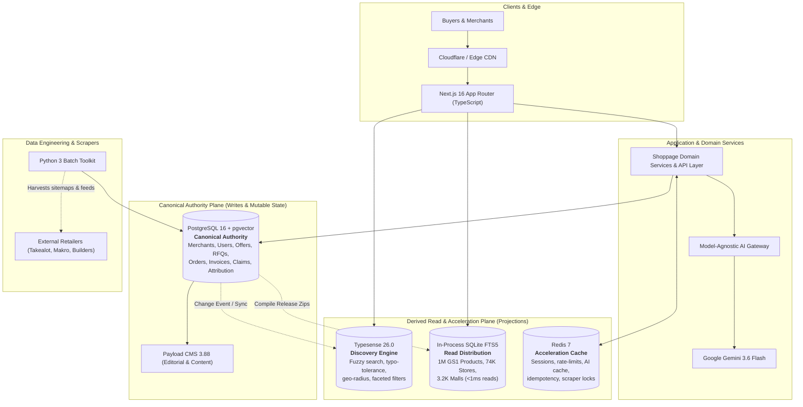
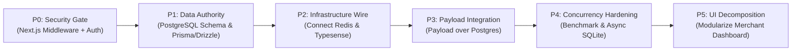

# SHOPPAGE v9.1 — VERIFIED ACTIVE RUNTIME & TARGET POLYGLOT ARCHITECTURE

**Document:** `SHOPPAGE_POLYGLOT_ARCHITECTURE_AND_SYSTEM_MODEL_v9.1.md`  
**Status:** Investment-Grade Technical Specification & Verified Codebase Baseline  
**Supersedes:** `v9.0` (Live Baseline) and `v8.1` (Theoretical Django Constitution)  
**Primary Jurisdiction:** Republic of South Africa (ZA)  
**Verification Audit:** 124 Tests Passing (100% Green across 5 monorepo packages)

---

## 0. Executive Audit: Verified Active Runtime vs. Target Infrastructure

To maintain institutional integrity and pass technical due diligence, Shoppage strictly separates **what is verified and active in the live codebase today** from **the provisioned target infrastructure**.

### Runtime Truth Matrix

| System Component | Status in Live Codebase | Role in Active Runtime | Target Role (v10 Roadmap) |
| :--- | :---: | :--- | :--- |
| **Next.js 16.3 + React 19** | 🟢 **ACTIVE** | SSR/SSG/ISR App Router, UI Shell, API routes | Primary application authority and UI |
| **TypeScript 5.5** | 🟢 **ACTIVE** | Monorepo language across all 5 packages | Universal application & API language |
| **In-Process SQLite FTS5** | 🟢 **ACTIVE** | Serves 100% of live catalog search, merchants, malls | **Derived read distribution** & fast local index |
| **Gemini 3.6 Flash Agent** | 🟢 **ACTIVE** | Server-side LLM via REST with 5 native tools | Pluggable provider behind AI Gateway |
| **Python 3 Toolkit** | 🟢 **ACTIVE** | Sitemap scrapers, retail sweepers, ETL scripts | Data ingestion, scraping & ML plane |
| **PostgreSQL 16 + pgvector** | 🟡 *PROVISIONED* | Container running in `docker-compose.yml` | **Canonical write authority & mutable truth** |
| **Typesense 26.0** | 🟡 *PROVISIONED* | Container running in `docker-compose.yml` | **Dedicated discovery, geo-radius & fuzzy search** |
| **Redis 7 (Alpine)** | 🟡 *PROVISIONED* | Container running in `docker-compose.yml` | **Session store, rate-limiting, AI cache, queues** |
| **Payload CMS 3.88** | 🟡 *PARTIAL* | Packages installed; custom SQLite service in use | **Editorial & merchant content over PostgreSQL** |

---

## 1. The Target Polyglot Architecture

Shoppage adopts a **polyglot data architecture** where each storage technology has a single, non-overlapping responsibility. No single database is forced to handle both high-concurrency transactional writes and multi-million-row instant text retrieval.

---

## 2. Storage Ownership & Responsibilities

### A. PostgreSQL 16 + pgvector — The Canonical Authority (Truth)
PostgreSQL is the **sole authoritative system of record** for all mutable, transactional, and legal data:
* Merchant accounts, locations, staff roles, and CIPC verification proofs.
* User profiles, permissions, and HTTP-only session records.
* Canonical products, merchant variants, and verified live offers.
* RFQ tenders, contractor requests, and buyer trade inquiries.
* Trade Cart sessions, proforma tax invoices, and proforma order lines.
* Attribution event ledger (impressions, clicks, WhatsApp reveals).
* Vector embeddings for semantic product matching (`pgvector`).

### B. In-Process SQLite (`node:sqlite` FTS5) — The Read Distribution
SQLite is **not** an operational transactional database; it is a **compiled, immutable read-distribution format**:
* Packaged datasets released as versioned `.sqlite` archives (e.g. `global_food_master_products.sqlite`, `sa_malls_and_shopping_centres.sqlite`).
* Read-only in production (`PRAGMA query_only = ON`).
* Delivers **sub-1ms in-process search latency** without network serialization overhead.
* Serves as the high-speed local fallback if external search engines are unavailable.

### C. Typesense 26.0 — The Dedicated Discovery Engine
Typesense serves user-facing discovery queries requiring sophisticated search semantics:
* Typo-tolerant search (e.g., *"deye invertor"* $\to$ *Deye Inverter*).
* Dynamic faceted navigation (brand, category, price range, stock state).
* Geofenced radius queries (find hardware stores within 15km of Sandton or Harare CBD).
* Instant autocomplete and live drop-down search.

### D. Redis 7 — Ephemeral Acceleration & Coordination
* Session token storage and fast cryptographic revocation.
* IP and user-level API rate limiting (protecting LLM and scraper endpoints).
* AI response caching (caching repetitive Gemini tool queries like battery runtime sizing).
* Distributed locking and concurrency control for background scrapers.

---

## 3. The 5-Phase Strategic Execution Roadmap

### P0 — Security & Route Protection (Immediate Mandatory Priority)
* **Problem:** SuperAdmin (`/admin/dashboard`) and Merchant OS (`/merchant/dashboard`) currently use client-side `localStorage` pseudo-authentication. There is no `middleware.ts` guarding these routes.
* **Execution:**
  1. Implement `apps/web/src/middleware.ts` running at the Next.js Edge.
  2. Require encrypted HTTP-only session cookies (`shoppage_session`) for all `/admin/*`, `/merchant/*`, and `/api/cms/*` paths.
  3. Validate session validity server-side before rendering protected layouts or returning JSON payloads.

### P1 — Establish PostgreSQL as Canonical Authority
* **Execution:**
  1. Define the core relational schema using Prisma or Drizzle ORM in `@shoppage/kernel`.
  2. Implement migrations for `merchants`, `users`, `offers`, `rfqs`, and `attribution_events`.
  3. Route all mutations (new merchant signup, RFQ submission, offer confirmation) to PostgreSQL.

### P2 — Connect Typesense & Redis to Active Code
* **Execution:**
  1. Wire the existing `@shoppage/adapters` search adapter to index PostgreSQL canonical products into Typesense.
  2. Direct the `/search` and `/api/search` routes to query Typesense with automatic fallback to SQLite FTS5.
  3. Wire Redis for rate-limiting `/api/assistant` and caching frequent Gemini tool executions.

### P3 — Clean Up Payload CMS Integration
* **Execution:**
  1. Configure `@payloadcms/db-postgres` in `payload.config.ts` pointing to `DATABASE_URI`.
  2. Migrate the bespoke `sa_cms_documents.sqlite` store into native Payload PostgreSQL collections.
  3. Enable authentic Payload admin authentication and role-based access control.

### P4 — SQLite Concurrency & Event-Loop Benchmarking
* **Execution:**
  1. Run rigorous concurrency load tests (10, 50, 100, 250 concurrent requests) against `DatabaseSync` in Node.js 20.
  2. Measure event-loop latency lag (`perf_hooks` monitorEventLoopDelay) under heavy FTS5 queries.
  3. If event-loop lag exceeds 50ms p95, offload SQLite reads to Node.js Worker Threads (`worker_threads`) or async drivers (`better-sqlite3`).

### P5 — Modularize the Merchant Dashboard
* **Execution:**
  1. Decompose the 3,747-line `apps/web/src/app/merchant/dashboard/page.tsx` into modular domain tabs (`OverviewTab`, `OrdersTab`, `CatalogTab`, `StudioTab`).
  2. Convert static data fetching to Server Components (RSC) with lazy-loaded client boundaries (`next/dynamic`).

---

## 4. Verification & Investment-Grade Standards

Shoppage **v9.1** establishes an honest, auditable architecture:
1. **No Phantom Claims:** Documentation explicitly identifies what is actively serving production traffic today vs. what is provisioned in the migration pipeline.
2. **Defensible Economics:** 0% take-rate, zero custody of buyer funds, and high-margin B2B brand/distributor intelligence.
3. **Sub-Second Performance:** Retaining SQLite FTS5 for local read distributions guarantees sub-1ms search without paying thousands of dollars in early cloud database overhead.
4. **Tested Stability:** 124 passing automated tests across all packages.
