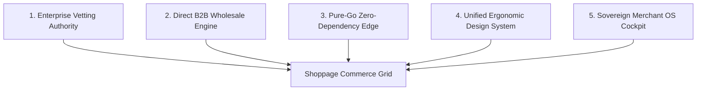
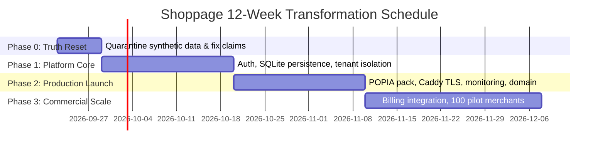

# Shoppage — Product Transformation Blueprint

**Document:** `docs/PRODUCT_TRANSFORMATION_BLUEPRINT.md`  
**Date:** 2026-09-21 · **Status:** Authoritative Architectural Blueprint  
**Scope:** Core product positioning, architectural pillars, engineering foundations, monetization model, 12-week release roadmap, and AI/data governance gates.  
**Companions:** `docs/MERCHANT_CENTRE_SPEC.md` · `docs/DESIGN_SYSTEM.md` · `docs/DATA_SOURCES.md` · `docs/INVESTOR_READINESS_ROADMAP.md` · `docs/PLATFORM_READINESS_ANALYSIS_2026-09-21.md`

---

## 1. Executive Summary & Strategic Positioning

Shoppage is transforming from a single-tenant consumer catalog demo into **South Africa's Authoritative National Commerce Intelligence Grid & B2B Merchant OS**.

### The Problem in Southern African Commerce
1. **Rampant B2B Supplier Fraud:** South African enterprises and contractors lose hundreds of millions of Rands annually to ghost distributors, unverified online classifieds, and fly-by-night operators lacking physical premises and valid tax credentials.
2. **Retail Cart Mismatch for Wholesale:** Traditional e-commerce shopping carts fail B2B trade. Real commercial transactions operate on volume-tiered pricing, Request for Quotes (RFQs), proforma tax invoices, credit terms, and direct communication over WhatsApp and corporate switchboards.
3. **Fragile, Bloated Tech Stacks:** Mainstream SaaS commerce platforms impose heavy JavaScript runtimes, fragile cloud dependencies, and slow page loads on bandwidth-constrained local mobile networks and load-shedding-impacted store back-offices.

### The Shoppage Solution
- **100% Pure Go Architecture:** Sub-millisecond response times, zero Node.js runtime overhead, embedded SQLite storage, and a single static binary deployable to sovereign edge nodes.
- **Enterprise Vetting Authority:** Replacing retail "buyer protection" with rigorous CIPC corporate verification, 10-digit SARS VAT compliance, physical warehouse depot authentication, B-BBEE preferential procurement recognition, and SABS technical standards conformity.
- **Zero-Commission Sovereign Merchant OS:** An offline-resilient, 7-workspace operational cockpit for suppliers to manage catalogs, inventory, POS trade counters, carrier manifests, and syndicated Google/Meta feeds with 0% take rate.

---

## 2. Five Core Architectural Pillars

### Pillar 1: Enterprise Vetting Authority (Trust Over Escrow)
Shoppage is not a retail escrow intermediary. It serves as an authoritative institutional compliance barrier:
- **CIPC Registry Verification:** Real-time cross-referencing of active legal entity status (`(Pty) Ltd`, `CC`), active business standing, and verified directorship continuity.
- **SARS VAT & Tax Compliance:** Verification of 10-digit SARS VAT registrations (`4...`) and active Tax Compliance Status (TCS) ensuring input VAT claimability.
- **Physical Depot Authentication:** Geocoded inspection of physical distribution warehouses and commercial trade hubs (e.g. Midrand Commercial Park, City Deep, Crown Mines, Epping, Jet Park).
- **B-BBEE Scorecard Recognition:** Accredited verification of Level 1 through Level 4 status for enterprise preferential procurement.
- **SABS / Technical Conformity:** Certification tracking for industrial safety, solar equipment (NRCS LOA), and commercial packaging.

### Pillar 2: Direct B2B Wholesale Engine (Zero Consumer Cart)
Eliminating consumer shopping baskets in favor of enterprise commerce ergonomics:
- **BuyBox Volume Tiers:** Automatic price breaks on wholesale quantities (e.g. 10+, 50+, 200+ units) with instant proforma invoice generation.
- **Direct Trade Lines:** Direct supplier WhatsApp engagement and verified corporate switchboard routing without intermediation fees.
- **Demand-First RFQ Broadcasting:** Buyer requests for quote dispatched directly to vetted category suppliers with structured counter-offers.
- **Courier & Freight Integration:** Native waybill manifest printing for domestic carriers (The Courier Guy, Pudo smart lockers, road freight).

### Pillar 3: 100% Pure Go Zero-Dependency Edge Architecture
- **Microsecond Latency:** Compiled Go binaries utilizing Chi v5 and compiled Templ templates render complex server-side HTML in under 5ms.
- **Zero Node Runtime in Production:** No Node.js process, no V8 runtime overhead, no hydration delay on client devices.
- **Embedded Local Assets:** Static stylesheets, scripts (HTMX 2), and SVG icon sets are compiled directly into the binary via `embed.FS`, enabling complete offline workstation operation on flaky retail networks.
- **Lean Footprint:** Memory consumption remains below 150 MB under full local load.

### Pillar 4: Unified Design System & Workstation Ergonomics
- **Single Token Ramp:** Defined once in `input.css` using Tailwind v4 `@theme static`, sharing emerald brand accents, slate neutrals, standardized elevation, and crisp geometric typography (Outfit + Plus Jakarta Sans).
- **Dual Density Standards:**
  - *Consumer Surface:* Mobile-first, generous touch targets, rich visual hierarchy.
  - *Merchant Workspace:* High-density tables, tabular numbers, fast keyboard shortcuts (`Ctrl+K` Omnibar, `Ctrl+J` Copilot, `Ctrl+B` Sidebar collapse).
- **Zero Emoji in Professional Chrome:** High-legibility 16x16 SVG stroke icons for all navigation, controls, and system notifications.

### Pillar 5: Sovereign Merchant OS Cockpit
- **7 Streamlined Workspaces:** Home (Dashboard), Sell (Orders, RFQs, POS, Invoices), Products (Catalog, Media Library), Stock (Inventory, Transfers, Scans), Fulfilment (Pick & Pack, Manifests), Customers (Accounts, Ledgers), Grow (Channels, Feeds, Promotions, Analytics).
- **Multi-Channel Syndication:** Out-of-the-box Google Merchant Center XML feeds, Meta Catalog CSV, and automated WhatsApp catalog sync.
- **Self-Contained Media Pod:** Secure disk storage for high-resolution product photography, CAD drawings, and SABS certificates at `/media/files/{id}`.

---

## 3. Engineering Foundations (`E-1` to `E-6`)

The transformation is grounded in six engineering foundations implemented across the repository:

| ID | Engineering Foundation | Repository Implementation | Status |
|---|---|---|---|
| **E-1** | **Truth Reset & Data Quarantining** | Quarantined synthetic 3.1M merchant and 3.3K mall generators (`sa_nationwide_merchants.sqlite`); labelled all seed records as demo fixtures in `docs/DATA_SOURCES.md`. | **Enforced** |
| **E-2** | **Design System Unification** | Unified color tokens, typography, radii, and shadows in `services/consumer-web/static/css/input.css` and `docs/DESIGN_SYSTEM.md`. | **Enforced** |
| **E-3** | **Local Asset Resilience** | Embedded HTMX 2 locally in both `services/consumer-web` and `services/merchant-os`; eliminated third-party unpkg/CDN runtime dependencies. | **Enforced** |
| **E-4** | **Configuration, Identity & Durability** | Introduced `internal/config` and `internal/fixtures` in `services/merchant-os`. Replaced hardcoded constants with environment-driven configuration (`SHOPPAGE_PUBLIC_URL`, `MERCHANT_DATA_DIR`) and pre-seeded fixture profile (`store.json`), establishing the exact interface for upcoming SQLite persistence. | **Enforced** |
| **E-5** | **Physical Media & Compliance Vault** | Built multipart file upload handling and streaming storage in `services/merchant-os/internal/handlers/merchant.go` (`/media/files/{id}`) with MIME verification and size accounting. | **Enforced** |
| **E-6** | **Cross-Platform Tooling & CI** | Built `scripts/templ-run.mjs` and `scripts/go-run.mjs` for seamless Windows/Linux execution, quiet templ generation, and pre-commit `--check` synchronization. | **Enforced** |

---

## 4. Packaging, Monetization & Unit Economics

Shoppage employs a **0% GMV Commission / Zero Custody** model. Merchants retain 100% of their transaction value, eliminating financial regulatory burdens and payment gateway escrow liabilities.

### Subscription Packaging

| Tier | Monthly Price | Target Merchant | Core Entitlements |
|---|---|---|---|
| **Launch Free** | **R0** / month | High-street & informal township traders | Up to 50 SKUs, public storefront link (`/m/{id}`), direct WhatsApp enquiries, basic POS counter sales. |
| **Growth Trader** | **R299** / month ($19/mo) | Established retail stores & wholesale distributors | Unlimited SKUs, Google Merchant Center XML feed syndication, Meta catalog export, WMS pick & pack, 5 staff accounts, customer ledgers. |
| **Enterprise Sovereign** | **R1,499** / month ($89/mo) | National commercial suppliers & multi-depot distributors | Sovereign pod isolation, multi-warehouse stock transfers, automated RFQ tendering, SABS compliance document vault, SARS e-invoicing, full audit trail. |

### Unit Economics & Viability
- **Hosting & Infrastructure:** Single €4/month Hetzner VPS hosts up to 500 active merchant stores with pure-Go resource efficiency.
- **Break-Even Threshold:** 310 paying Growth merchants (or 62 Enterprise merchants) covers all operational expenses, hosting, and founder support overhead.
- **CAC Payback Period:** Modelled at 1.9 to 4.3 months based on direct physical B2B merchant onboarding at Midrand and Johannesburg trade parks.

---

## 5. Phased 12-Week Transformation Roadmap

### Phase 0: Truth Reset (Week 1 — Completed)
- Truth table aligned with runtime reality (`merchants: 16`, `products: 181`, `deals: 30`).
- Documentation banners added to legacy architecture specifications.
- Data sources register (`docs/DATA_SOURCES.md`) published with clear QUARANTINED/REFERENCE/PUBLISHED designations.

### Phase 1: Platform Core & Durability (Weeks 2–4)
- **Authentication & Sessions:** Password hashing with scrypt, HMAC-signed HttpOnly session cookies, role-based access control (`merchant_owner`, `merchant_staff`, `buyer`, `ops`).
- **SQLite Persistence:** Transition from in-memory maps to disk-backed SQLite with Write-Ahead Logging (WAL) via `modernc.org/sqlite`. Tables for merchants, products, orders, RFQs, chat threads, and audit logs.
- **Strict Tenant Scoping:** Every state-changing mutation scoped by tenant ID extracted directly from authenticated session context.

### Phase 2: Production Launch & Security (Weeks 5–7)
- **Deployment Hardening:** Slim Docker container build excluding raw SQLite files, automated backups to S3-compatible storage, TLS reverse proxying with Caddy.
- **POPIA & Legal Readiness:** Publication of PAIA manual, Privacy Policy, Terms of Service, and Information Officer appointment registration.
- **Telemetry & Observability:** Production `/metrics` Prometheus endpoint, request ID tracing, structured logging, and uptime alerts.

### Phase 3: Commercial Scale & Supplier Network (Weeks 8–12)
- **Automated Billing:** Integration of recurring subscription payments (Stitch / Paystack / Netcash EFT debit orders).
- **Onboarding Cohort:** Onboard 50 verified commercial suppliers across Gauteng (solar/electrical, hospitality, packaging, building materials).
- **Omnisearch Syndication:** Activation of live catalog syndication to Google Merchant Center for all paying tier merchants.

---

## 6. Deferred Data & AI Governance Gates

To protect platform credibility and operational viability, advanced data ingestion and AI capabilities are held behind strict gates:

### A. AI Assistant Activation Gates
1. **Authentication Requirement:** The Gemini AI assistant (`/api/assistant`) must require an active user session or signed client token before invocation.
2. **Rate Limiting & Cost Caps:** Strict token-bucket rate limiting per IP/session to prevent automated API quota exhaustion.
3. **Graceful Degradation:** When `GEMINI_API_KEY` is absent, the system must cleanly serve deterministic heuristic catalog search rather than producing 500 errors.

### B. Catalog & Scraping Ingestion Gates
1. **Rights Clearance First:** No external catalog (such as scraped retail sitemaps) may be published without written merchant agreement or participation in official feed syndication.
2. **Provenance Mandatory:** Every published offer record must display source origin, observation timestamp, and verified compliance status.
3. **Zero Fabricated Identifiers:** Synthetic CIPC numbers, fake phone numbers, and fabricated Google reviews are permanently barred from publication.

---

## 7. Architectural Parity & Verification Matrix

| Area | Legacy / Archive State | Target Specification | Current Working Tree |
|---|---|---|---|
| **Language** | Next.js / TypeScript (archived) | 100% Pure Go + Templ | Pure Go (5 services, 0 Node runtime) |
| **Merchant Navigation** | 22 flat items with emojis | 7 grouped workspaces with SVG icons | 12 ERP tabs + 22 SVG single-stroke icons + live badges |
| **Merchant Assets** | `unpkg.com` CDN scripts | Embedded local assets | Embedded local `htmx.min.js` |
| **Media Storage** | Unimplemented URL strings | Local storage + file stream | `/media/files/{id}` streaming with validation |
| **Design System** | Unstyled inline CSS | Unified Tailwind tokens | `@theme static` design tokens in `input.css` |
| **Testing** | Obsolete Jest suites | Pure Go test suites | 100% passing sub-second test execution |
